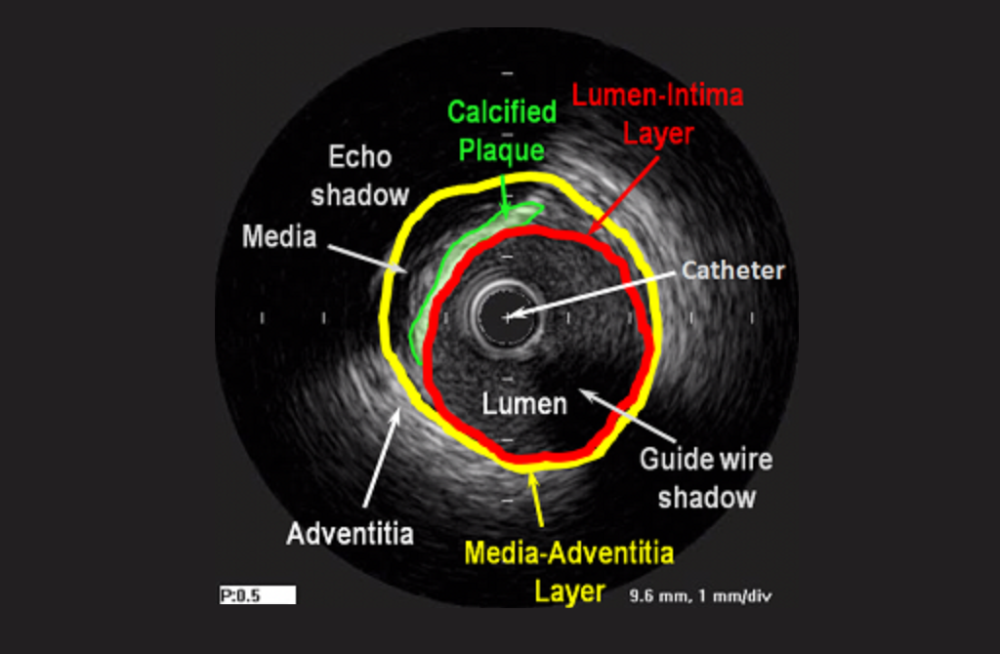
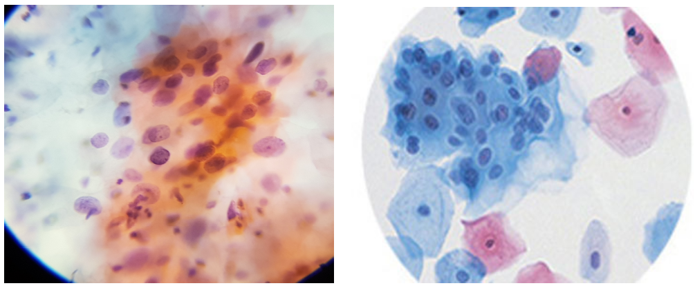

# Medical Data

## Introduction

의료 분야에서의 데이터들에 대해 간단한 소개 및 특징, AI 학습 시 어떤점을 고려해야 하는지에 대해 요약하는 문서입니다.

## Chest X-ray

## Digital Pathology

## IVUS

IntraVascular UltraSound의 약자로 혈관 내를 초음파를 이용하여 촬영하는 방법이다. 소형화된 초음파 프로브와 함께 특별 제작된 Catheta를 이용하여 혈관 내의 병변을 찾아낸다.

위 그림처럼 이미지가 구성되며, 일반적으로 EEM\(External Elastic Membrane\)이라 불리우는 Vessel 영역과 실제 혈류가 지나가는 Lumen, 그리고 병변 부위인 Thrombus\(혈전\)을 검출하는 것이 주 목적이다.

초음파 데이터 특성상 Grayscale 이미지로 특징을 분별하는데 Color가 개입이 없기 때문에 Texture와 Shape의 영향이 가장 크다. 특히, IVUS의 경우 중심을 기준으로 일정 영역 크기안에서만 data가 발생되기 때문에 이것을 기준삼아 다양한 처리를 가해주는 것이 좋다.

실제 IVUS Segmentation을 Deep Learning으로 진행하면서 유의미한 효과를 보았던 Augmenation 방법들은 다음과 같다.

* Rotation 90도 단위
* Horizontal / Vertical Flip
* Brightness, Contrast Adjustment

이 외에도 효과적인 방법이 있겠지만, 사실 Annotation만 제대로 되어있다면 위에 언급된 3가지를 분류하기에는 큰 지장이 없다고 볼 수 있다. Shadow와 같이 영역 자체를 가리는 것이 아니라면 데이터 양과 Annotation의 Quality에 따라 성능이 정해진다고 볼 수 있겠다.

## Cytology

Pathology에서는 전반적인 형태를 보고 진단을 하지만, Cytology는 세포 단위로 그에 맞는 진단을 내린다. 세포학에 해당하는 분야는 굉장히 많겠지만 예를 들어 Pap Test라 불리우는 자궁경부암에서의 세포진 검사를 예로 들면 다음과 같다.

왼쪽은 Conventional 방식의 슬라이드에서 촬영된 이미지이고, 오른쪽은 Liquid 방식의 슬라이드에서 촬영된 이미지이다. Conventional의 경우 세포를 채취하여 슬라이드에 평평하게 바르는 작업을 거치기 때문에 세포 사이의 위상차가 생겨 Focus를 어떻게 맞추냐에 따라 슬라이드 이미지가 굉장히 달라지게 된다. 반면, Liquid 방식은 특수한 용액을 통해 자연스럽게 모여 보기 편한 상태로 퍼지기 때문에 Conventional과 비교하여 굉장히 깔끔한 이미지를 얻을 수 있다.

Cytology 이미지들은 Pathology와 마찬가지로 염색시약이 사용되기 때문에 컬러가 다양하다. 일반적으로 병리\(의\)사들은 세포질과 세포핵을 동시에 보고 판별하지만, AI가 경계가 모호한 세포질까지 판단하기는 어렵다고 본다. 세포학 분야에서의 Task로는 Detection과 Segmentation이 주가 되므로 이에 대한 Annotation이 필요하다.

염색시약에 종속적인 데이터가 나오므로 이를 고려하는 전처리/Augmentation들이 필요하다고 생각한다.

* Rotation
* Horizontal / Vertical Flip
* Gaussian Blur \(Focus가 맞춰진 정도나 Noise 제거용\)
* Elastic Deformation \(의료 분야에서 다양하게 사용되는 변환방법, 위치별로 affine 변환이 이루어지기 때문에 자연스러운 변화를 줄 수 있음\)
* Hue/Saturation Adjustment
* Brightness/Contrast Adjustment
* Scale \(세포 크기가 다양하기 때문에 Multi scale에 robust하도록\)

위와 같은 다양한 처리 방식이 들어갈 수 있지만, 모든 데이터가 그렇듯이 항상 잘되는 것은 아니다. 데이터에 맞춘 사용법이 필요하다. Pap test의 AI detection 학습 시, Hue/Saturation보다는 Brightness/Contrast가 더 효과적이었으며 Scale도 나름 효과적이었다.

## Karyotyping

