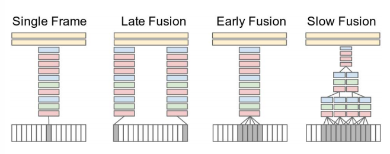

# \(작성중\) Deep Learning: Introduction to Video Classification with CNN

## 1. Introduction

Video 데이터는 Image들이 일반적으로 시간 순으로\(또는 무작위로\) 쌓여 있는 구조이다. 그래서 기존의 Image 단위에서 사용한 처리 방법들을 어느정도 그대로 사용이 가능하며, Video에서만 끌어낼 수 있는 정보들을 얻기 위해서는 단위 Image에서는 알 수 없는 시간 정보 등을 포함하여 처리한다.

CNN과 같은 Deep learning이 활성화되기 전에는 Bag-of-Words 개념을 사용한 solution이 가장 일반적인 접근법이라고 볼 수 있다. Deep learning 구조들은 이런 전통적인 handcraft feature들을 사용한 방법들을 대부분 건너 뛰게해주기 때문에 feature를 어떻게 잘 뽑아낼 것인지도 중요하지만 어떻게 효율적인 구조로 모델링을 할지가 좀 더 중요하다고 볼 수 있을 것 같다.

다른 Task들에서도 Dataset에 대한 이해는 매우 중요한데, Video의 경우 Text나 Image 들보다 월등히 많은 용량을 차지하고 영상의 길이도 제각각이어서 입력값으로써 표준화하는 작업도 중요하다.

## 2. Time Information Fusion

asas

References

* [https://towardsdatascience.com/introduction-to-video-classification-6c6acbc57356](https://towardsdatascience.com/introduction-to-video-classification-6c6acbc57356)
* [https://static.googleusercontent.com/media/research.google.com/en//pubs/archive/42455.pdf](https://static.googleusercontent.com/media/research.google.com/en//pubs/archive/42455.pdf)

