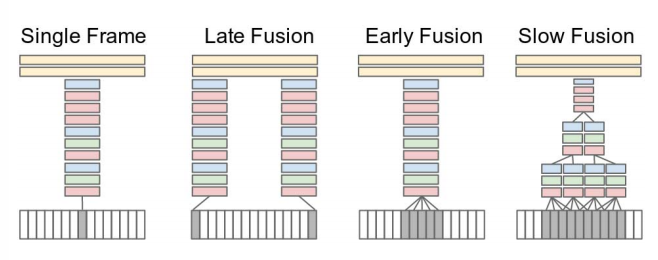
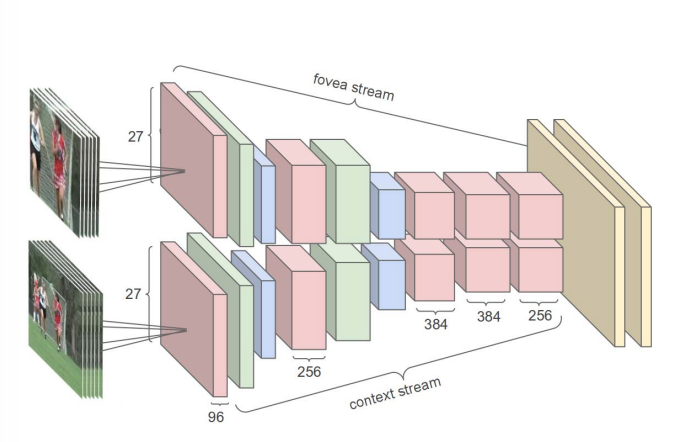

# \(작성중\) Deep Learning: Introduction to Video Classification with CNN

## 1. Introduction

Video 데이터는 Image들이 일반적으로 시간 순으로\(또는 무작위로\) 쌓여 있는 구조이다. 그래서 기존의 Image 단위에서 사용한 처리 방법들을 어느정도 그대로 사용이 가능하며, Video에서만 끌어낼 수 있는 정보들을 얻기 위해서는 단위 Image에서는 알 수 없는 시간 정보 등을 포함하여 처리한다.

CNN과 같은 Deep learning이 활성화되기 전에는 Bag-of-Words 개념을 사용한 solution이 가장 일반적인 접근법이라고 볼 수 있다. Deep learning 구조들은 이런 전통적인 handcraft feature들을 사용한 방법들을 대부분 건너 뛰게해주기 때문에 feature를 어떻게 잘 뽑아낼 것인지도 중요하지만 어떻게 효율적인 구조로 모델링을 할지가 좀 더 중요하다고 볼 수 있을 것 같다.

다른 Task들에서도 Dataset에 대한 이해는 매우 중요한데, Video의 경우 Text나 Image 들보다 월등히 많은 용량을 차지하고 영상의 길이도 제각각이어서 입력값으로써 표준화하는 작업도 중요하다.

## 2. Time Information Fusion

기본 CNN은 단일 Image\(예 - 224x224x3 input tensor\)만 입력으로 들어가는데, Video에서는 아래와 같은 다양한 방식으로 CNN 입력 구조를 변경하여 시간정보를 더할 수 있다.

1\) Single Frame : 단일 Frame 정보를 CNN의 입력으로 사용한다. 기본 CNN을 그대로 사용하는 것과 같다.

2\) Late Fusion : 단일 Clip\(30fps면 30 frame을 의미하는 듯\)에서 처음과 끝 부분의 frame을 이용하는 방법.

3\) Early Fusion : 단일 Clip에서 가장 큰 연속 Segment\(대충 동일 object가 연속으로 등장하는 Scene등을 의미하는 듯 함.\)를 입력으로 사용.

4\) Slow Fusion : 4개의 서로 다른 연속 Segment를 Overlap하여 입력으로 사용.

여기서 소개된 방법들은 참조된 논문에서의 방법이며, 이 외에도 현재 frame 기준 앞, 뒤 N frame들을 이어 붙여 사용하는 방법 등 다양한 방법이 존재한다.

## 3. Multi-Resolution Information

기존의 Image Task에서도 다양한 Object들\(크기, 종류\)에 대한 학습을 할 때, Multi-Resolution에 대해 정보를 줄 수 있는 여러 방법을 사용한다. 그 중 한 가지로 전체 Image와 그 Image의 일부를 Crop하여 Multi Input을 이용하는 법이 있다.

예를 들면, 

## References

* [https://towardsdatascience.com/introduction-to-video-classification-6c6acbc57356](https://towardsdatascience.com/introduction-to-video-classification-6c6acbc57356)
* [https://static.googleusercontent.com/media/research.google.com/en//pubs/archive/42455.pdf](https://static.googleusercontent.com/media/research.google.com/en//pubs/archive/42455.pdf)
* [https://cs.stanford.edu/people/karpathy/deepvideo/](https://cs.stanford.edu/people/karpathy/deepvideo/)
* [https://www.crcv.ucf.edu/data/UCF101.php](https://www.crcv.ucf.edu/data/UCF101.php)
* [https://static.googleusercontent.com/media/research.google.com/en//pubs/archive/42455.pdf](https://static.googleusercontent.com/media/research.google.com/en//pubs/archive/42455.pdf)
* 
