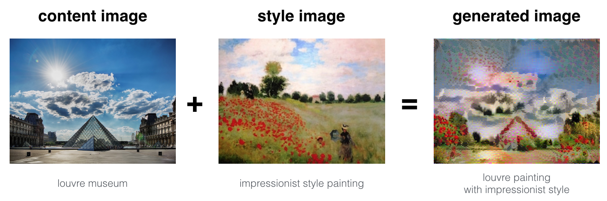

# Deep Learning: Style Learning

## 1. Introduction

Style transfer learning은 두 가지의 입력 이미지\(Content & Style\)가 주어지면, Content의 내용물\(형태\)은 최대한 유지하며 목표로 하는 Style을 적용시키는 방법이다. 쉽게 말해 아래 그림 같은 예를 들 수 있다.

이렇게 학습하는 방법으로는 크게 2가지로 나뉠 수 있다.

1. Pre-trained 네트워크 모델을 이용하는 방법
   * Content 네트워크와 Style 네트워크의 feature map을 추출하여 새롭게 합성될 이미지의 feature map을 이들과 유사하게 학습하는 방법
   * 장점 : 이미지 2장\(Content & Style\)만으로 학습 가능
   * 단점 : 합성할 이미지마다 최적화가 필요하여 시간이 오래걸림
2. Style transfer 네트워크 모델을 이용하는 방법
   * 서로 다른 도메인\(A style, B style\)끼리 변환되는 네트워크를 학습
   * 장점 : 네트워크를 학습한 후 사용만 하면 됨
   * 단점 : 도메인 별로 학습을 해야 , 데이터가 많이 필요함

## 2. Methods

### 2.1. Image Style Transfer Using Convolutional Neural Networks

2016년 CVPR에서 발표된 논문으로 CNN을 이용하여 Style Transfer Learning을 성공적으로 수행하였다. 주요 포인트는 Pretrained VGG 19모델을 이용하여 Content와 Style 이미지 간의 차이를 줄여주는 방법을 End-to-End로 만들었다. 공식 코드 및 사람들이 작성한 코드를 기반으로 좀 더 분석하자면,

* Model : Pretrained VGG 19 \(Gradient update 없음\)
* Input Image
  * Content : Style을 적용하고자 하는 이미지 \(Gradient update 없음\)
  * Style : Content 이미지에 적용하고자 하는 Style을 갖는 이미지 \(Gradient update 없음\)
  * Target : 적용하고자 하는 Style을 적용한 Content 이미지
    * Random Noise, Content Image, Style Image 중 1개를 선택
    * Gradient update 있음 \(Content + Style Image로 변환이 진행되어야 하기 때문\)
  * Initialization : Content나 Style 이미지로 초기화하면, 항상 같은 Output만 나옴. 하지만, White noise로 초기화하면 매 번 새로운 이미지 생성. \(Output의 퀄리티는 거의 차이가 없음\)
* Gram Matrix : Style Representation Feature 추출을 위해 각 Layer마다 추출된 Feature끼리 gram matrix를 이용하여 correlation을 계산한다. 이렇게 얻어진 multi-layer 간 correlation은 stationary하고 multi-scale을 아우르는 feature가 된다.
* L-BFGS \(Limited-memory BFGS\) : Quasi-Newton 방법 중 하나로 복잡한 Hessian Matrix 연산이 들어가는 optimization에서 유용함.

### 2.2. GAN based Style Transfer Learning

기본적으로 GAN은 random noise를 이용하여 원하는 타겟 output을 생성해내고 판별하는 2개의 Network 구조로 되어있다. Vanilla GAN은 Style을 따로 지정하기가 어려우며, 그 뒤로 나온 GAN들은 조건을 붙이거나 구조를 변형하여 원하는 Style\(안경, 포즈, 머리색 등\)을 추가하거나 빼는 형태까지 가능하다. 그 중 2개에 대해서만 짧막하게 다뤄본다.

**2.3.1. Style GAN**

Vanilla GAN에서 Style에 대한 latent space를 만드는 network를 따로 두어 좀 더 효과적으로 이미지에 원하는 style을 적용하게 만들었다. \(아래 그림 참조\)

왼쪽은 기존의 GAN 구조이며, 오른쪽은 제안된 Style GAN의 구조이다. 왼쪽의 FC들로만 이루어진 작은 network로 random input vector에 대해 immediate latent space로 변경시켜주는 구조이다. 이렇게 임의의 벡터를 network를 거쳐 기존의 GAN에서 input vector의 분포가 Gaussian처럼 한정적이던 부분을 해결했다.

학습된 latent vector를 가짜 데이터를 생성하는 network layer마다 추가 정보로 주어 각 layer에서 style정보를 받아들이게했다. 데이터 생성 network의 input layer에서는 style 정보를 받지않는데, 저자가 실험을 통해 input layer에서는 style정보가 무의미하다고 한다. 또한, style정보 말고도 추가로 각 layer에 random noise를 더해주는데 이것을 통해 style에 stochastic variation을 준다고 한다.

위 그림을 보면 \(a\)는 모든 layer에서 noise를 준 것이며, \(b\)는 모든 layer에 noise 추가가 없는 것이다. \(c\)는 fine style을 담당하는 layer에만, \(d\)는 coarse style을 담당하는 layer에만 준 것이다. 잘 살펴보면 noise를 주지 않았을 때보다 noise를 준 것이 훨씬 정교한 이미지를 생성하며, 더 다양한 이미지를 생성한다.

**2.3.2. Gated GAN**

기존 Neural Transfer Learning처럼 content, target\(style\) 이미지 구성으로 학습하는 GAN이다. 기존 GAN이나 Style GAN이랑 다르게 Encoder와 Decoder 사이에 Transformer라는 gate module을 두었다. Network구조는 아와 같으며 gate마다 style을 다르게 줄 수 있도록 학습한다. 이 구조를 통해 encoder, decoder 파라미터는 공유하고 gate module만 style 수만큼 추가하여 효율적인 형태로 1개의 network로 multi style을 적용할 수 있게 하였다.

Gated GAN에서는 Discriminator에서 Real/Fake를 분류하는 기존의 GAN 부분과 Auxiliary Classifier를 두어 Style 종류를 맞추는 2가지 output으로 나뉜다. LabelGAN처럼 이 2부분을 합치는 경우도 있지만 이렇게하면 Overlaid-gradient problem이 발생해 학습에 안좋은 영향을 주게된다. 아래 그림은 gated GAN을 학습하여 artist의 style대로 input 이미지에 적용시킨 예이다. 단일 모델로 다양한 style을 학습할 수 있음이 증명되는 것 같다.

## 3. Conclusion

전통적인 방법을 제외하면 딥러닝으로 Style Learning을 하는 방식은 일반 Neural network와 GAN을 이용한 방식이 있다. 전자보다는 GAN의 방식이 학습 및 범용성에 있어서는 더 좋고 실제로도 많이 사용되고 있다. Gated GAN과 같이 단일 모델에서 multi style의 학습이 가능해짐으로써 실제 task들에 사용하기 더욱 쉬워지게 되었다. 좀 더 학습의 정교함과 1024x1024의 HD 이미지 이상을 얻게될 수 있게 변화하면 훨씬 유용하지 않을까 싶다.

## References

* [https://blog.lunit.io/2017/04/27/style-transfer/](https://blog.lunit.io/2017/04/27/style-transfer/)
* [https://www.popit.kr/neural-style-transfer-%EB%94%B0%EB%9D%BC%ED%95%98%EA%B8%B0/](https://www.popit.kr/neural-style-transfer-%EB%94%B0%EB%9D%BC%ED%95%98%EA%B8%B0/)
* [https://towardsdatascience.com/style-transfer-styling-images-with-convolutional-neural-networks-7d215b58f461](https://towardsdatascience.com/style-transfer-styling-images-with-convolutional-neural-networks-7d215b58f461)
* [https://datascience-enthusiast.com/DL/Art\_Generation\_with\_Neural\_Style\_Transfer\_v2.html](https://datascience-enthusiast.com/DL/Art_Generation_with_Neural_Style_Transfer_v2.html)
* [https://seongkyun.github.io/papers/2019/11/13/style\_transfer/](https://seongkyun.github.io/papers/2019/11/13/style_transfer/)
* [https://www.cv-foundation.org/openaccess/content\_cvpr\_2016/papers/Gatys\_Image\_Style\_Transfer\_CVPR\_2016\_paper.pdf](https://www.cv-foundation.org/openaccess/content_cvpr_2016/papers/Gatys_Image_Style_Transfer_CVPR_2016_paper.pdf)
* [https://github.com/cysmith/neural-style-tf/blob/a2c374f9ee2938f0022e1e0b720f4eb28cf7d0a8/neural\_style.py\#L406](https://github.com/cysmith/neural-style-tf/blob/a2c374f9ee2938f0022e1e0b720f4eb28cf7d0a8/neural_style.py#L406)
* [https://github.com/leongatys/PytorchNeuralStyleTransfer/blob/master/NeuralStyleTransfer.ipynb](https://github.com/leongatys/PytorchNeuralStyleTransfer/blob/master/NeuralStyleTransfer.ipynb)
* [https://wikidocs.net/22155](https://wikidocs.net/22155)
* [https://arxiv.org/pdf/1812.04948.pdf](https://arxiv.org/pdf/1812.04948.pdf)
* [https://arxiv.org/pdf/1904.02296v1.pdf](https://arxiv.org/pdf/1904.02296v1.pdf)
* [https://blog.lunit.io/2019/02/25/a-style-based-generator-architecture-for-generative-adversarial-networks/](https://blog.lunit.io/2019/02/25/a-style-based-generator-architecture-for-generative-adversarial-networks/)
* [https://github.com/rosinality/style-based-gan-pytorch/blob/8437a8bbd106ad4a4691b798ce35d30b5111990b/model.py\#L451](https://github.com/rosinality/style-based-gan-pytorch/blob/8437a8bbd106ad4a4691b798ce35d30b5111990b/model.py#L451)
* [https://arxiv.org/pdf/1703.02000.pdf](https://arxiv.org/pdf/1703.02000.pdf)
* [https://github.com/colemiller94/gatedgan/blob/master/models.py](https://github.com/colemiller94/gatedgan/blob/master/models.py)

