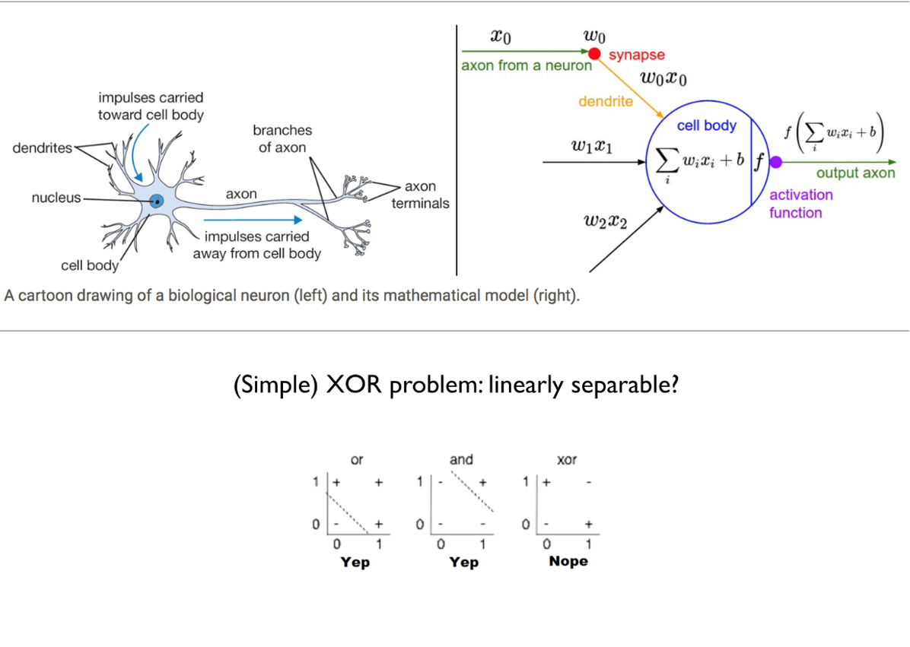

# Introduction to Machine Learning \(1\)

## 1. Machine Learning and Deep Learning

### 1.1. Machine Learning과 Deep Learning의 간단한 차이점

점점 여러 곳에서 들려오고 있는 머신러닝\(Machine Learning\)과 딥러닝\(Deep Learning\)은 개념은 인공지능\(Artificial Intelligence\)이라는 큰 틀 안에 들어 있다. 특히, 정말 핫해지고 있는 딥러닝의 경우 머신러닝의 하위 개념이라고 볼 수 있다.\(머신러닝이 더 큰 개념\)

그림에서 보듯, 인공지능이라는 것은 Data를 통해 Problem을 해결하는 어떤 Solution을 얻는 Learning을 진행하는 것이다. 쉽게 말하면 문제를 풀 수 있는 방법을 찾겠다는 거다. 그런 방법 중에 머신러닝이라는 컴퓨터가 스스로 문제를 풀 수 있도록 하는 하위 개념이 있는 것이다. 머신러닝의 경우 컴퓨터가 해결하고자 하는 문제들 마다 학습을 하기 위한 단서\(Feature\)를 사람이 직접 만들어야 하지만, 딥러닝의 경우 이런 단서조차 스스로 학습한다. 그렇기 때문에 딥러닝은 좀 더 편하게\(?\) 학습한다고 볼 수 있다.\(실제로는 여러 조건이 필요하다..\) 

추가적인 내용으로 명시적 프로그래밍이라는 것은 Data와 판별하는 기준을 통해 정답을 맞추는 행위로 Data에 맞춰 기준을 정하기 때문에 Data가 조금만 달라져도 판별이 어렵지만 머신러닝의 경우는 주어진 Data들에서 정답으로 향하는 판별식을 만드는 것이기 때문에 어느정도 유연한 대처가 가능해진다.

### 1.2. Machine Learning Task 종류들

머신러닝의 학습법에는 크게 4가지의 종류들이 있다.

* Supervised Learning\(지도학습\)은 모든 데이터에 정답이 달려 있어 그에 맞게 학습하는 것을 의미한다. 지도학습의 경우 보통 Classification나 Regression 문제를 풀 때 많이 사용된다.
* Unsupervised Learning\(비지도학습\)은 모든 데이터에 정답이 없어 정답까지도 스스로 유추하여 학습하는 방식이다. 정답이 따로 정해져 있는 것이 아니기 때문에 Clustering같이 유사한 Data끼리 모으는 작업이나, Auto-Encoder에 사용된다.
* Semi-Supervised Learning\(준지도학습\)은 지도학습과 비지도학습을 반반 섞은 것으로 데이터의 일부만 정답이 달려 있다.\(많이 사용되는 편은 아니다.\)
* 앞선 것들과 크게 다른 개념으로 Reinforcement Learning\(강화학습\)이라는 것이 있다. 정답이 따로 있다고 하기에는 애매하지만 어떤 성공 목표를 기준으로 삼고 이를 달성하기 위해 할 수 있는 행동들을 갖고 각 행동을 할 때마다 점수를 매겨 성공을 할 때 까지 가장 점수를 높게 만드는 특정 행동이나 행동 패턴들을 학습한다. 이런 특징으로 일반적인 문제들보단 게임처럼 특정 행동에 대해 점수를 매길 수 있는 문제들에 많이 이용된다.

딥러닝의 대부분은 Neural Network라고 하는 인간의 뇌의 구조를 본뜬 형태로 학습을 진행한다. 인간의 뇌가 서로 신호를 주고 받는 기본 단위인 뉴런을 컴퓨터에서 계산하는 방식대로 바꾸어 여러 겹으로 쌓은 것이 바로 인공신경망이다.

실제 뇌에서 뉴런들이 서로 신호를 주고 받는 것처럼 인공신경망도 뉴런의 앞단에서 정보를 받아 뉴런 자체가 갖는 Weight를 곱하여 데이터를 변화시키고 이를 다음 뉴런으로 보내준다. 계산 자체는 간단한 Linear Equation이지만 모여서 강력한 힘을 발휘한다. 

하지만, 초창기 인공신경망은 고작 간단한 XOR문제도 풀지 못했다. 그 당시에는 인공신경망의 각 Layer에서 단순한 선형방정식과 Layer의 깊이 등 많은 문제로 인해 XOR과 같은 비선형 문제를 풀 수 없었기 때문이다. 시간이 지나면서 문제점들을 해결하기 위한 많은 방법들이 등장하기 시작했다.

### 1.3. Backpropagation

인공신경망의 발전에 가장 큰 공로는 바로 이 Backpropagation\(역전파\)이지 않을까 싶다. 이 방법이 발표되고 나서 효율적으로 인공신경망 학습이 진행되어 기존 방법들에서는 각 뉴런에서의 가중치를 적절하게 학습하지 못한 점을 해결했다.

전파는 간단하게 설명하자면 기존의 머신러닝 학습법과 마찬가지로 마지막에 유추한 결과와 실제 정답을 비교하고 그 차이로 발생한 Loss값을 역으로 전파할 때, 그림과 같이 Chain rule에 의해 결과부분에서 한 단계 전 Layer로 전파할 때마다 이전에 지났던 Layer들의 Gradient 값을 누적으로 곱하면서 이를 이용해 Loss를 Input Layer까지 전파해준다.\(쓰고보니 간단하지 않아 보인다...\) 간단히 2~3 Layer를 그려 직접 계산까지 해본다면 아주 쉽게 이해가 갈 것이다. 이게 힘들다면 시각적으로 설명한 자료들이 많으니 그것을 참고하면 좋을 듯 하다.

Reference : [http://jaejunyoo.blogspot.com/2017/01/backpropagation.html](http://jaejunyoo.blogspot.com/2017/01/backpropagation.html)

### 1.4. Activation Function

인공신경망에서는 뉴런의 구조만 흉내내면서 출력부분에 Activation function이라는 것을 두어 선형적인 출력이 아닌 비선형적인 출력을 가능하게 만들었다. 이런 비선형함수를 이용하여 출력 공간을 비틀어야 앞서 풀지 못했던 XOR과 같은 문제를 해결 할 수 있다. 초창기에 많이 쓰였던 활성화 함수로는 Sigmoid와 Hyperbolic Tangent\(하이퍼볼릭 탄젠트\)가 많았는데 이 둘은 모델의 깊이가 깊어지고 Layer가 넓어질수록 Gradient Vanishing이나 Exploding 현상이 발생하여 지금은 거의 사용을 하지 않는다. 활성화 함수들의 종류를 몇 가지 간단하게 소개하자면 이런 것들이 있다.

* Hyperbolic Tangent: 초기에 가장 많이 쓰였던 형태의 함수이며, 실제로 RNN이나 LSTM같은 모델에서는 아직도 사용중이다. 비슷한 형태의 Sigmoid에 비해 연산량이 조금 더 많아서 동일 모델에서 사용할 경우 이쪽이 좀 더 느리다.

* Sigmoid: Tanh가 연산량이 많아 대체로 쓰였던 함수. 0에서 1사이로 값을 Mapping하고 tanh에 비해 연산량도 적고 유사한 형태를 갖는다. tanh에 마찬가지로 gradient vanishing 문제가 있어 이제는 쓰이지 않는다. 현재는 모델의 마지막 Output에 0에서 1로 Mapping하여 확률표현정도로만 사용된다.

* ReLU \(Rectified Liner Unit\): Gradient vanishing 문제를 해결하기 위해 도입된 함수. 기존의 tanh, sigmoid와 다르게 선형 함수이며 선형이기 때문에 미분도 쉽다. sigmoid는 입력값이 0에서 멀어질수록 gradient가 너무 작아져 back-propagation시 gradient가 사라지는 현상\(gradient vanishing\)이 발생하는데 ReLU에서는 그럴 걱정이 없다. 음수부분은 애초에 output이 0이므로 gradient가 필요없고, 양수부분은 그대로 출력이기 때문이다!

* Leaky ReLU / PReLU \(Parametric ReLU\): 기존의 ReLU에서 음수부분만 0.01x로 대체되었다. 이렇게 변형한 이유는 ReLU에서 음수값은 항상 0의 Gradient를 갖기 때문에 그 부분 neuron들이 죽어버린다. \(dying ReLU\) 이렇게 죽어버린 뉴런들은 다시 활성화되기 힘들기 때문에 적절치 못한 학습이 될 수 있다. 그래서 음수값을 약간이나마 살려두어 이러한 문제를 해결하려 했다. 실제로 사용하면 나아졌다는 결과들도 있긴하다. \(하지만 많지는 않은듯..?\) PReLU의 경우는 0.01부분이 학습가능한 변수 a로 바뀐 것으로 큰 차이가 없다. 사실상 이 2가지 함수도 ReLU에 비해 기적적으로 높은 변화를 주진 않는다. 그래서 기본적으로 학습 시에는 ReLU가 default.

* ELU \(Exponential Linear Unit\): ReLU 함수계열이지만 음수부분이 기존과는 다르게 exponential이 들어가있다. 기존 ReLU function들의 장점인 gradient vanishing해결과 dying ReLU를 해결하고 출력값도 거의 zero-centered에 가깝다. 하지만 exponential이 들어가 연산량은 많이 증가하게 된다. \(쉽게 되는건 없는가보다\)

* SELU \(Scaled Exponential Linear Unit\):  PReLU처럼 학습 가능한 변수를 ELU에 끼워넣은 것으로 좀 더 함수가 smooth해졌다. 설명으로는 학습 시 Activation function의 분산이 일정하게 나와서 성능이 좋아진다고 하지만, 실제로 ReLU에 비해 극적으로 좋아지진 않는다.

* Swish: Swish 함수는 최근 Google에서 선보였다. 논문에서는 ReLU보다 challenging domain에서 더 좋은 성능을 보인다고 한다. 아래 링크의 저자가 실험한 것과 논문을 참조로 다음과 같이 몇 가지 의견을 낼 수 있을 것 같다.
  * 쉬운 모델 또는 쉬운 문제일 경우, ReLU와 Swish 함수는 거의 유사한 성능을 보임. 이런 경우에는 오히려 ReLU가 연산량이 적으므로 더 유리함.
  *  ImageNet같이 어려운 문제일 경우 Swish가 더 좋은 성능을 보이며, 특히 sigmoid안 input에 trainable parameter beta를 넣은 swish-beta 함수가 조금 더 좋은 성능을 보였음. \(dying ReLU 현상을 더 잘 극복하는 듯 합니다.\)

Paper : [https://arxiv.org/pdf/1710.05941v1.pdf](https://arxiv.org/pdf/1710.05941v1.pdf)  
Reference : [https://medium.com/@jaiyamsharma/experiments-with-swish-activation-function-on-mnist-dataset-fc89a8c79ff7](https://medium.com/@jaiyamsharma/experiments-with-swish-activation-function-on-mnist-dataset-fc89a8c79ff7)

* Maxout: 유명한 이안 굿펠로우가 2013년도에 발표한 함수. Dropout의 개념을 넣기위해 기존의 Activation function들과 생김새가 완전히 달라졌다. 이 그림이 가장 잘 차이를 보여주는 것 같아 가져왔다. 왼쪽의 ReLU를 보면 Input에 대해 Weight W를 곱하고 Bias b를 더한 후 activation을 거친다. 반면, maxout의 경우 Input에 대해 2개의 Weight와 Bias를 두어 각각 계산 후 2개의 결과 중 max값을 취한다. 이렇게 하게되면 기존의 Activation function들과 다르게 출력의 형태를 비선형 형태로 표현하는게 아닌 그림과 같이 선형 함수들의 모음으로 표현하게 된다.

이런 방식은 dropout과도 유사한 방식으로 볼 수 있으며, model averaging의 효과가 있다. 실제로 maxout 사용 시 ReLU와 같은 기존 Activation function보다 좋은 성능을 보인다. \(왼쪽 그림\) 또한, Layer가 많아질수록\(모델이 깊어질수록\) 기존의 함수들보다 overfitting의 위험성이 현저히 낮다. 이는 Maxout을 사용할 경우 dying ReLU를 상당수 피할 수 있다는 의미이며, 학습에 최적인 neuron들을 선택하는 경우가 더 많다고 볼 수 있다. 장점이 많은 maxout이지만, 기존의 Activation function들과 비교하여 연산량 및 메모리소모가 2배이상이라는 점에서 효율적인 사용이 어려운 것 같다. \(그래서 아직도 대부분 ReLU를 사용한다\)

Paper : [https://arxiv.org/pdf/1302.4389v4.pdf](https://arxiv.org/pdf/1302.4389v4.pdf)  
Reference : [http://blog.naver.com/laonple/220836305907](http://blog.naver.com/laonple/220836305907)

이외에도 많은 Activation function들이 존재하지만 대표적인 것들만 일단 추려보았다. 모델 학습을 할 때, 모든 문제에 대해 최적인 함수는 없으므로 풀고자하는 task에 따라 직관을 이용하여 선택하거나 다양하게 실험하며 적절한 함수를 사용하는 것이 필요하다.

