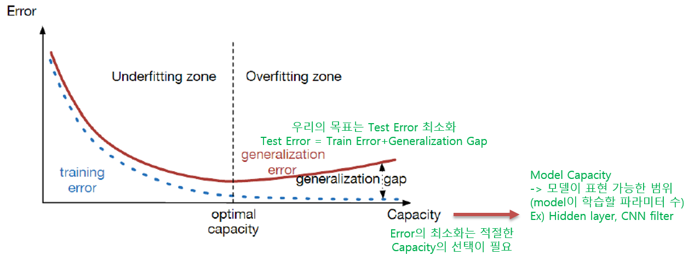
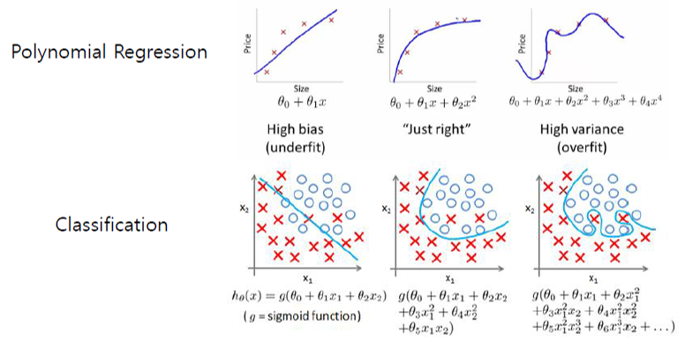
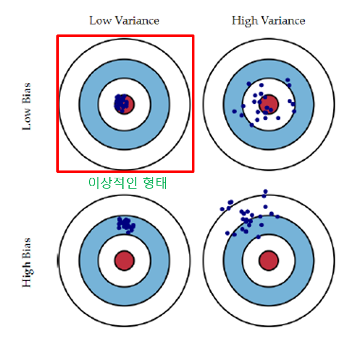
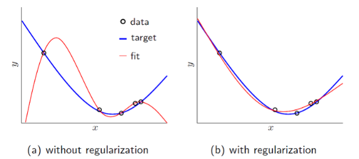
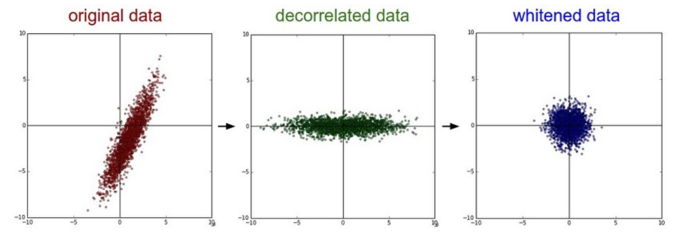

# Introduction to Machine Learning \(2\)

## 2. Underfitting/Overfitting and Regularization

### 2.1. Generalization

학습을 통해 하고자하는 것은 결국 주어진 데이터에 대해서 뿐만 아니라 다른 데이터에서도 일관되게 좋은 결과를 내는 것을 만들고자 함이다. 이를 일반화\(Generalization\)라고 하며, 학습의 성과를 판단하는데 중요한 지표가 된다.

모델의 Capacity에 대해서는 다음 그림을 보면 좀 더 자세히 설명이 가능하다. 모델이 너무 단순하면\(capacity가 낮으면\) 주어진 데이터를 충분하게 표현하지 못하고, 반대로 너무 복잡하면\(capacity가 높으면\) 주어진 데이터에 너무 딱 맞게 표현하여 유연하지 못하다. 일반적으로 학습 시에는 Underfitting 문제는 거의 일어나지 않고 보통 Overfitting이 일어나는데, 이를 해결하는 방식에는 크게 2가지를 사용한다. 

첫 번째로는 모델의 capacity를 줄여 학습해야 할 parameter수\(Feature 수\)를 줄이는 것이다.\(모델 자체를 바꾸거나 PCA등의 dimension reduction 방법을 사용한다.\) 두 번째로는 모델의 capacity는 그대로 두고 Regularization을 추가하여 적정 범위 안에서 학습되도록 돕는 방법이 있다.

### 2.2. Bias-Variance Trade-off

Bias-Variance Trade-off라는 것으로 Underfitting과 Overfitting을 다시 한 번 살펴볼 수 있다. Variance\(분산\)은 데이터가 평균에서 얼마나 떨어져 있는지를 나타내며, Bias\(편차\)는 가설을 통해 추측한 값들이 실제 값과 얼마나 떨어져 있는지를 나타낸다. 그림을 보면 좀 더 쉽게 이해가 가능한데, Variance가 높을 수록 데이터가 한 지점에 모여있지 않고 퍼져있으며, Bias가 높을 수록 예상되는 평균 지점에서 멀리 떨어져 있음을 알 수 있다. 

이상적인 데이터 형태로는 Variance와 Bias 모두 낮은 것을 원하지만 실제로 이런 데이터는 거의 없다. 일반적으로는 둘 중 하나가 높거나 둘다 높은 경우들이 있어 Variance와 Bias는 어느정도 반비례하는 성질을 갖는다. 모델의 학습정도를 평가할 때는 Bias가 너무 높으면 Overfitting일 확률이 크며, 반대일 경우는 Underfitting일 경우가 크다. 그래서 Variance와 Bias의 균형을 잘 맞춰야 좋은 모델을 학습할 수 있다.

### 2.3. Regularization

Regularization은 앞서 잠깐 언급한 것처럼 모델을 안정적으로 학습하기 위한 방법이다. 일반적으로는 Bias를 변화시키기보다는 Variance을 줄이는 방식으로 적용된다. 시각적으로 표현하자면 Regularization을 적용 하기 전과 후는 그림처럼 큰 차이를 보인다. 머신러닝에서 사용되는 Regularization의 대표적인 방법들이 몇 가지 있는데, L1/L2 Regularization이 그 예이다. Cost function\(인공신경망의 경우는 중간 Layer\)에 적절한 Penalty를 주어 모델의 capacity를 일정 범위 이상으로 벗어나지 않게 도와준다. 딥러닝에서는 L1/L2 Regularization보다는 Dropout이라고 불리우는 것을 더 많이 사용하며, BatchNormalization, InstanceNormalization, Data augmentation 등 각 문제에 알맞는 다양한 Regularization들이 존재한다.\(이 부분에 대해서는 나중에 따로 정리\)

Variance 문제를 해결하기위해 Data/Activation Normalize과 같은 전처리 또는 후처리 방법들도 많이 사용된다.

* Whitening\(Sphering\) : 인접 Pixel들의 연관성을 줄이는 과정.\(평균을 0으로 shift하고 모든 데이터의 표준편차를 1로 정규화\) -&gt; Standardization -&gt; input의 normalization
* 표준화\(Standardization\) : 평균을 기준으로 얼마나 떨어져 있는지 재조정. 2개 이상의 대상이 서로 단위가 다를 때 각 대상의 표준편차를 이용하여 정규화함.
* 정규화\(Normalization\) : 전체 구간을 0~1로 재조정. 데이터 군내에서 데이터가 가지는 위치를 파악할 때 유용하다. Activation을 거치며 생기는 Shift는 보통 Batch Normalization을 사용하여 해결한다.
* Batch 단위로 Mean, Std를 계산하여 Normalization
* BN을 통해 실질적인 학습속도 및 정확도 향상이 있음.
* BN은 평균을 빼고 표준편차로 Normalize하는 과정에서 weight가 작아져 Regularization 효과도 존재함.

Reference : [https://stats.stackexchange.com/questions/29130/difference-between-neural-net-weight-decay-and-learning-rate](https://stats.stackexchange.com/questions/29130/difference-between-neural-net-weight-decay-and-learning-rate)

