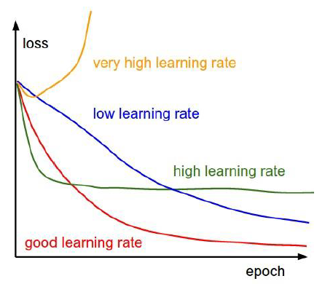

# Introduction to Machine Learning \(3\)

## 3. Gradient Descent and Weight Initialization

### 3.1. gradient Descent

머신러닝을 통해 어떤 문제를 풀려고 할 때, 우리는 그 문제를 해결하기 위한 어떤 가정을 세워야 한다. 이를 식들로 표현하면 다음과 같다.

* Hypothesis\(가설\) : 우리가 원하는 결과를 낼 수 있는 방법\(가정\)

  Ex\) 선형 방정식을 통한 regression : 

* Cost\(Loss\) function : 우리의 가설이 실제 정답과 얼마나 유사 한지\(다른지\) 정도를 측정하는 함수

  Ex\)                                    

* 실제 사용되는 형태의 Cost 함수 : 

우리가 최종적으로 원하는 것은 오류가 가장 적은 방향으로 학습하는 것이므로 cost를 minimize하는 것이다. 그러면 어떻게 우리는 cost를 minimize 할 수 있을까? 머신러닝에서는 Gradient Descent를 이용해서 cost를 최소화한다.

Gradient Descent Method\(경사 하강법\)은 Gradient가 최소가 되게 하는 방향으로 계속해서 변수를 업데이트하는 방식으로 대략적인 수식은 다음과 같다.

수식에서 알파가 의미하는 것은 Learning Rate로 Cost function의 변화를 얼마나 반영하여 학습할지를 결정한다. Learning Rate의 경우는 문제마다 실험적으로 결정하게 된다.

* Sigmoid Function : Input x를 0~1로 변환하여 표현하는 함수. Binary Classification/Regression에 많이 사용된다. Sigmoid를 적용한 Cost Function은 다음과 같다.

* Softmax Classifier : intuitive output\(normalized class probabilities\)

  -&gt; cross-entropy loss를 사용하여 표현한다.

일반적으로 Sigmoid 함수를 이용한 Cost function은 MSE\(Mean Square Error\)를 사용하여 학습을 진행한다. 하지만, Regression이 아닌 Classification이나 Neural Network에서는 MSE를 사용할 시 Sigmoid의 문제인 1또는 0에 가까운 위치에서의 gradient가 급격하게 작은 값을 갖는 문제를 보인다. 이를 해결하기 위해, cross-entropy를 사용하며 위와 같이 표현한다.

Reference : [http://solarisailab.com/archives/2237](http://solarisailab.com/archives/2237)

### 3.2. Weight Initialization

딥러닝 학습 시 Initial weight를 잘 정하고 시작하면 복잡한 문제도 좀 더 간다하게 해결 가능해진다. 이 때, 너무 랜덤한 값이나 전부 0으로 시작하면 안된다. -&gt; not all 0’s \(전부 0으로 초기화하면 Back-propagation 시 Gradietn 전달이 안됨. Gradient가 0이 되기 때문\) 잘못된 초기화는 이런 문제들도 일으킬 수 있다.

* Vanishing Gradient : update gradient value 0\(gradient값이 너무 작아 0에 수렴하여 weight가 update되지 못함\)
* Exploding Gradient : update gradient value very large\(gradient값이 너무 커서 무한대까지 가버림\)

모든 머신러닝 학습의 목표는 Global minimum 값에 수렴하는 것이다.\(Find optimal parameters\) 앞선 설명처럼 이 값은 Cost Function을 정의하여 Gradient descent를 이용해 최소가 되는 지점을 찾기 때문에 초기 값\(위치\)이 매우 중요하다. 초기 값이 정답과 너무 멀거나 다가갈 수 없는 지점에서 시작하면 문제를 풀기가 매우 어려워지기 때문이다. 일반적으로 적절한 Learning rate를 고정해서 설정하면 좋은 결과를 내기는 어렵다. 그래서 Learning rate decay라는 방법을 사용하여 학습의 효율을 높일 수 있다.

* Learning rate decay : Global minimum에 가까워 질수록 learning rate를 낮추는 방법. 적절한 learning rate를 통해 빠른 학습이 가능하다.

가중치 초기화에는 몇 가지 방법이 있는데 일반적으로는 이 3가지를 사용한다.

* Gaussian 초기화 : 평균 0, 표준편차가 1인 가우시안 분포로 weight를 초기화한다.
* Xavier 초기화 : sigmoid나 tanh를 사용할 때, gradient가 적절히 전달해주도록 하는 초기값
* He 초기화 : ReLU를 사용할 때, 절반은 0으로 바뀌는 걸 고려한 초기값

  초기화 방법은 문제마다 적절하게 선택하면 좋으며, 거의 대부분은 Gaussian 초기화를 사용한다.

