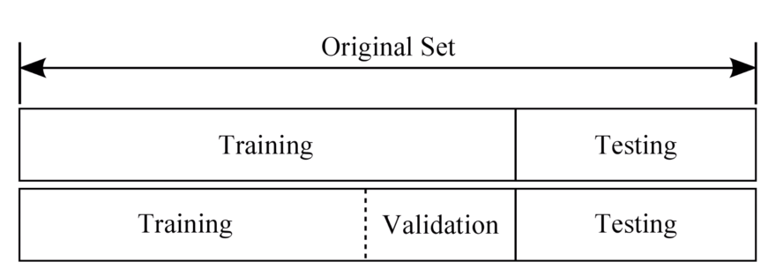
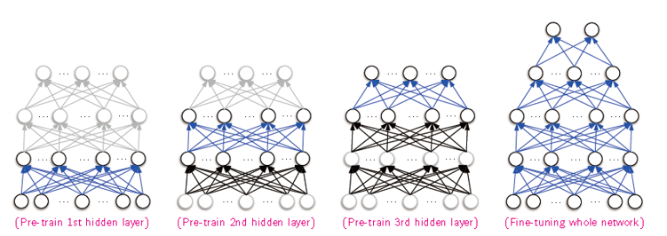

# Introduction to Machine Learning \(4\)

## 4. Dataset

학습을 진행할 데이터들은 적절한 형태로 분배해야 학습의 효율을 높일 수 있다. 일반적으로 모델의 파라미터를 학습할 때 사용될 Training set, 중간 중간 검증용으로 사용되는 Validation set, 학습이 모두 끝난 후 모델의 성능을 평가하는 Testing set으로 구성된다. Dataset이 너무 작거나 필요에 따라 Validation set를 Training set에 합쳐서 사용하기도 한다.

* Training Set – Model을 학습하기 위함
* Validation Set – Model의 Hyper parameter 검증용\(모의고사\)
* Testing Set – Model의 성능을 Test\(학습 후 실제 결과를 내기 위해\)

일반적으로 Train과 Test를 나누는 비율을 8:2가 적절하며, Validation까지 할 경우 7:1.5:1.5나 7:1:2 정도가 적절하다.\(물론 적절한 비율을 알아서 택하면 된다. 다만, 너무 적은 training set이나 validation/testing set을 두면 학습이 잘 안되거나 테스트 성능이 신뢰할 수 없게 된다.\)&lt;/p&gt;

데이터셋을 적절하게 나누어 모델을 평가하는 방식으로 Cross validation이라는 방식이 사용된다. 이 방식은 보통 dataset이 작을 때 많이 사용되는데, dataset이 작으면 그만큼 모델이 학습되었을 때 성능에 대한 신뢰도가 작아지기 때문이다. 이 방법을 통해 2가지 목적을 달성이 가능하다.

* Unseen 데이터에 대한 성능 평가
* 더 좋은 모델 선택

K-fold라는 방법이 가장 많이 사용되는 방식이며, 데이터셋을 K개의 묶음으로 나누어 그 중 1개를 Validation에 사용하고 나머지를 Training에 사용하는 방법이다. 이런 작업을 K번 반복하여\(한 번 사용한 fold를 제외하고 나머지에서 validation을 고름\) 테스트 성능의 평균을 취하는 것이다. 이 방법은 모델의 성능을 적절하게 평가하는데 유용하여 많이들 사용한다. 몇 개의 Fold로 나눌지는 직접 해봐야 알기 때문에 꽤나 귀찮은 작업이 아닐 수 없다.\(그래도 정확한 모델 성능 평가를 위해 필수적이라고 볼 수 있다.\)

Reference : [https://3months.tistory.com/321](https://3months.tistory.com/321)

## 5. Learning Methods

머신러닝을 학습함에 있어 몇 가지 방법들이 존재하는데 큰 틀에서의 방법 몇 가지를 소개한다.

* Online Learning : Data를 한 개 또는 Mini-batch 단위로 학습하며 실시간으로 테스트하는 학습법. 예를 들면, 실시간으로 변하는 주식의 가격 변동 학습
* Offline Learning : 학습을 위해 준비한 Training set을 이용하여 학습을 모두 진행 후 테스트 하는 방법. 한 번 학습이 끝나면 더 이상 학습을 진행하지 않음.
* Transfer Learning : Find Tuning과 유사하다. 미리 학습된\(pre-trained\) 모델에 대해 전혀 다른 modality의 데이터를 학습시키는 방법이다. Fine Tuning과 다른 점은 모델 전반적으로 학습을 한다는 것.
* Fine Tuning : Pre-training된 model에 원하는\(분류하고자 하는\) 데이터를 재학습시켜 파라미터들의 미세한 조정을 함\(초기값 및 학습정도, 데이터 등 다양한 조건을 잘 조절해야함\)

