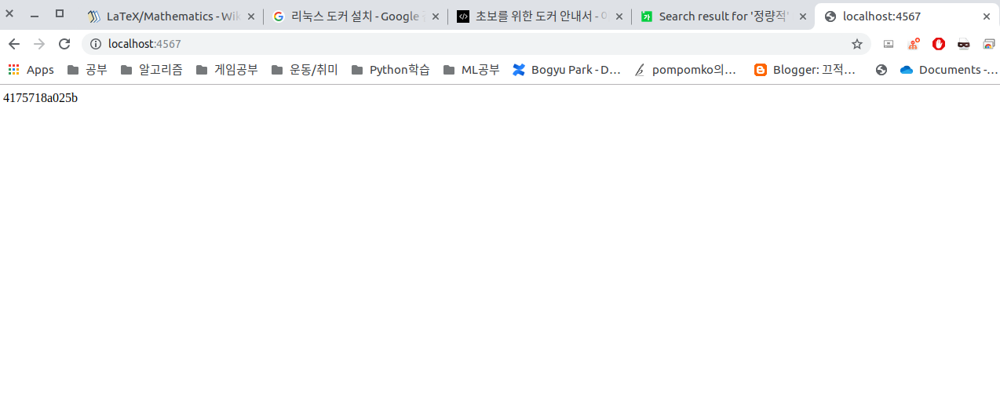

# Docker: Creating and Deploying

## 도커 이미지 만들기

도커는 이미지를 만들 때, 컨테이너의 상태를 그대로 저장하는 방법을 사용함.

예를 들면, 우분투 이미지에 원하는 프로그램을 추가로 설치하여 하나의 애플리케이션을 동작시킬 수 있는 환경을 구성하려면 우분투 이미지를 다운받고 그 안에서 쉘 명령어들로 필요한 것들을 전부 설치해야 한다. \(기존 방법들과 크게 다를건 없다.\) 하지만, 이런걸 잘 몰라도 기존에 많은 사람들이 많은 조합들을 만들어두었기 때문에 왠만한건 다 있으니 갖다 쓰면 된다.

### Sinatra 웹 애플리케이션 만들기

Sinatra를 사용하기 위한 Gemfile과 app.rb라는 파일을 만들어야 함. vim이든 뭐든 사용하여 원하는 장소에 만든다.

**Gemfile**

```text
source 'https://rubygems.org'
gem 'sinatra'
```

**app.rb**

```text
require 'sinatra'
require 'socket'

get '/' do
  Socket.gethostname
end
```

루비로 작성되어있기 때문에 실행을 하려면 다음과 같은 코드를 입력해야 한다.

```text
bundle install            # install package
bundle exec ruby app.rb   # Run sinatra
```

하지만, 루비가 설치되어 있지 않으면 안되기 때문에 도커를 이용해서 간단히 실행을 해볼 수 있다.

**Run ruby**

```text
docker run --rm \
-p 4567:4567 \
-v $PWD:/usr/src/app \
-w /usr/src/app \
ruby \
bash -c "bundle install && bundle exec ruby app.rb -o 0.0.0.0"
```

실행이 완료되고 [http://localhost:4567](http://localhost:4567) 로 접속하면 아래와 같이 도커 컨테이너의 호스트 명이 보인다.



### Dockerfile 사용하기

도커는 이미지를 생성할 때 Dockerfile 이라는 이미지 빌드용 DSL\(Domain Specific Language\)를 사용한다. 도커 이미지를 생성하는 명령어\(?\)들을 텍스트 파일에 옮겨놓은 것으로 일반적으로 소스코드 + Dockerfile로 구성되어 배포한다. 아래의 순서대로 우선 쉘스크립로 표현해 보

| **순서** | **작업** |
| :--- | :--- |
| 1 | ubuntu 설치 |
| 2 | ruby 설치 |
| 3 | 소스 복사 |
| 4 | Gem 패키지 설 |
| 5 | Sinatra 서버 실 |

**Shell Script 표현**

아래 명령어를 순서대로 ubuntu 컨테이너에서 실행해도 sinatra 서버를 안정적으로 실행이 가능하다.

```text
# 1. ubuntu 설치 (패키지 업데이트)
apt-get update

# 2. ruby 설치
apt-get install ruby
gem install bundler

# 3. 소스 복사
mkdir -p /usr/src/app
scp Gemfile app.rb root@ubuntu:/usr/src/app  # From host

# 4. Gem 패키지 설치
bundle install

# 5. Sinatra 서버 실행
bundle exec ruby app.rb
```

**Dockerfile 표현**

쉘 스크립트의 내용을 거의 그대로 옮겼으며, 도커 빌드 중에는 키보드 입력이 안되기 때문에 미리 -y 옵션을 넣어줌.

```text
# 1. ubuntu 설치 (패키지 업데이트 + 만든사람 표시)
FROM       ubuntu:16.04
MAINTAINER subicura@subicura.com
RUN        apt-get -y update

# 2. ruby 설치
RUN apt-get -y install ruby
RUN gem install bundler

# 3. 소스 복사
COPY . /usr/src/app

# 4. Gem 패키지 설치 (실행 디렉토리 설정)
WORKDIR /usr/src/app
RUN     bundle install

# 5. Sinatra 서버 실행 (Listen 포트 정의)
EXPOSE 4567
CMD    bundle exec ruby app.rb -o 0.0.0.0
```

**OPTIONS**

* **FROM** : 베이스 이미지 지정. TAG로 지정하는 버전은 lastest보다는 구체적인 버전을 적어주는 것이 좋음.
* **MAINTAINER** : Dockerfile을 관리하는 사람의 정보를 입력. \(이름, 메일주소 등\)
* **COPY** : 파일이나 디렉토리를 이미지로 복사. 일밙거으로 소스를 복사할 때 사용함.
* **ADD** : COPY와 유사하나 src 입력에 파일 대신 URL입력 하거나 압축 파일을 지정 시 자동으로 압축을 해제하여 파일을 전송함.
* **RUN** : 명령어를 그대로 실행. 내부적으로 '/bin/sh -c' 를 실행 후 명령어가 실행 되는 로직임.
* **CMD** : 도커 컨테이너가 실행 되었을 때, 실행되는 명령어를 정의. 빌드할 때는 실행되지 않고 여러 개의 CMD가 있으면 가장 마지막 CMD만 실행된다. 한 번에 여러 프로그램을 실행 시킬 경우, run.sh나 supervisord, forege와 같은 프로그램을 사용해야 한다.
* **WORKDIR** : RUN, CMD, ADD, COPY 등이 이루어질 기본 디렉토리 설정. 각 명령어의 현재 디렉토리는 매번 초기화되기 때문에 같은 디렉토리에서의 작업을 위해 지정해줄 필요가 있음.
* **EXPOSE** : 도커 컨테이너가 실행되었을 때, 요청을 기다리는 포트 지정\(Listen\). 여러 포토를 지정 가능함.
* **VOLUME** : 컨테이너 외부 파일시스템을 마운트 할 때 사용. 기본으로 지정하는 편이 좋음.
* **ENV** : 컨테이너에서 사용할 환경변수 지정. 컨테이너 실행 시, -e 옵션을 사용하면 기존 값을 오버라이딩하여 사용함.

만들어진 Dockerfile는 다음과 같이 빌드해볼 수 있다. 빌드한 이미지의 이름을 지어줄 -t 옵션을 사용하여 빌드하면 끗.

```text
docker build [OPTIONS] PATH | URL | -

docker build -t app .

```

### Dockerfile 최적화

이전 예제의 Dockerfile에서 사실 우분투 베이스 이미지 말고 ruby 베이스 이미지를 사용하면 더 간편해진다.

```text
# before
FROM ubuntu:16.04
MAINTAINER subicura@subicura.com
RUN apt-get -y update
RUN apt-get -y install ruby
RUN gem install bundler

# after
FROM ruby:2.3
MAINTAINER subicura@subicura.com
```

도커 이미지 빌드 시, Dockerfile의 명령어가 수정되거나 추가하는 파일이 변경 될 때 캐시가 깨져서 새로운 이미지를 재생성하기 때문에 시간을 많이 잡아먹게 됨. 그래서 캐시가 깨지는 것을 최대한 방지하여 빌드 시간을 줄여야 함.

**예제 소스 캐시 최적화**

```text
COPY . /usr/src/app    # <- 소스파일이 변경되면 캐시가 깨짐
WORKDIR /usr/src/app
RUN bundle install     # 패키지를 추가하지 않았는데 또 인스톨하게 됨 ㅠㅠ

# Gemfile을 미리 복사하여 ruby gem 패키지 설치를 무시
COPY Gemfile* /usr/src/app/ # Gemfile을 먼저 복사함
WORKDIR /usr/src/app
RUN bundle install          # 패키지 인스톨
COPY . /usr/src/app         # <- 소스가 바꼈을 때 캐시가 깨지는 시점 ^0^
```

**명령어 최적화**

* -qq 옵션을 넣어주어 패키지 설치 시 나타나는 로그를 보이지 않게 해줌.
* --no-doc와 --no-ri 옵션으로 필요 없는 문서 생성을 방지.
* 명령어가 비슷한 것은 묶어서 레이어 생성을 줄이는 것이 좋음.

```text
# 로그 최적화
# before
RUN apt-get -y update

# after
RUN apt-get -y -qq update


# 문서 작업 최적
# before
RUN bundle install

# after
RUN bundle install --no-rdoc --no-ri


# 레이어 생성 최적화
# before
RUN apt-get -y -qq update
RUN apt-get -y -qq install ruby

# after
RUN apt-get -y -qq update && \
    apt-get -y -qq install ruby
```

## 도커 이미지 배포

도커는 빌드한 이미지를 git처럼 도커 레지스트리라고 불리는 이미지 저장소에 push & pull 하여 사용함. 도커 레지스트리는 오픈소스이며 무료로 설치 가능. 설치형이 아닌 것을 사용하려면 도커 허브를 사용하면 됨.

### Docker Hub

도커 허브를 사용하려면 docker login 명령어로 로그인을 해야한다. \(그 전에 미리 웹사이트에서 회원가입 필요\) 도커 이미지 이름은 다음과 같이 구성된다.

```text
[Registry URL]/[사용자 ID]/[이미지명]:[tag]


# tag 명령어는 기존에 만들어진 이미지의 이름을 지어줄 수 있음.
docker tag SOURCE_IMAGE[:TAG] TARGET_IMAGE[:TAG]

# Docker Hub에 Push 하기
docker push subicura/sinatra-app:1
```

* **Registry URL** : 기본적으로 docker 허브를 바라보고 있어서 docker.io가 자동 입력. 특정 URL 지정도 가능.\(Private 저장소 같이\)
* **사용자 ID** : 지정하지 않으면 기본 ID인 library로 지정됨.
* **이미지 명** : 이전 예제들처럼 Name:Version 의 형식으로 지정하면 됨.

도커의 배포 방식은 빌드한 이미지를 업로드하고 다운로드 받을 줄 만 알면 끗. 업데이트 과정도 복잡하지 않다. 그냥 기존에 잘 작동 중인 컨테이너를 끄고, 새 컨테이너로 덮어 쓴 후 다시 실행하면 된다. 물론 이 과정에서 잠깐 공백이 생기지만 이를 보완하는 무중단 배 방법들도 있다.

## References

* [https://subicura.com/2017/02/10/docker-guide-for-beginners-create-image-and-deploy.html](https://subicura.com/2017/02/10/docker-guide-for-beginners-create-image-and-deploy.html)

