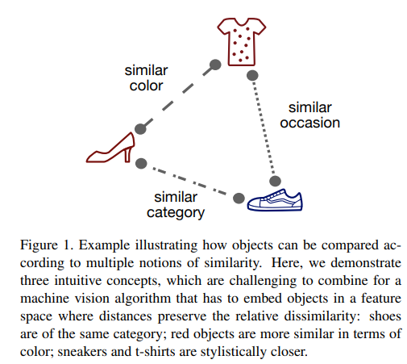
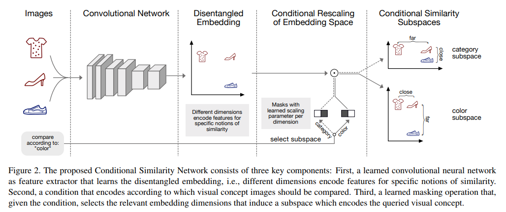
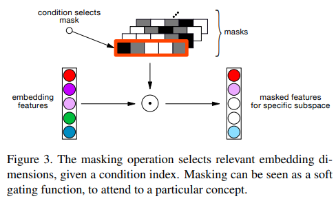
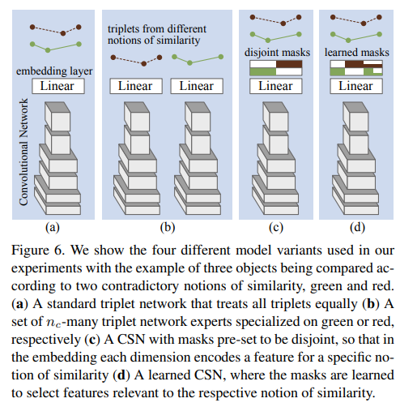
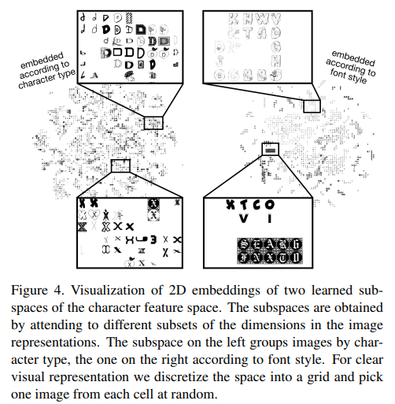
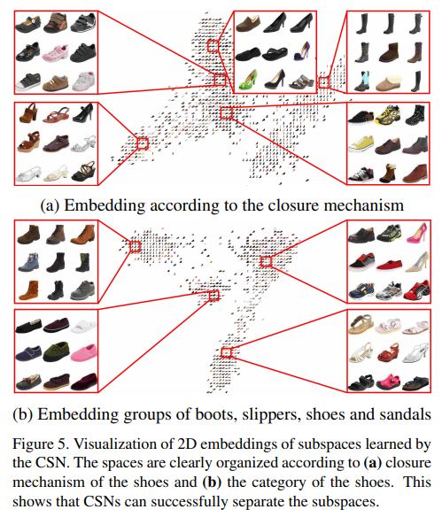
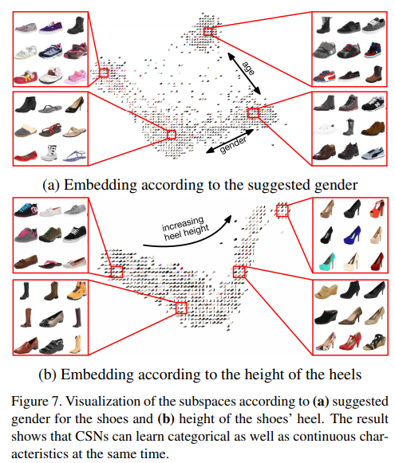
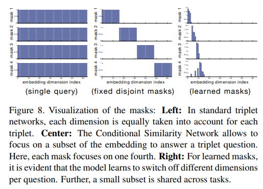
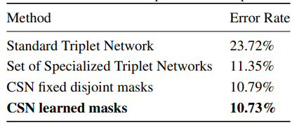
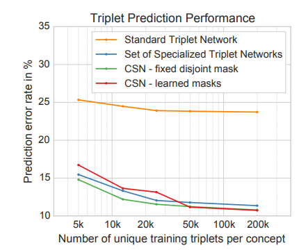

# \(2016\) Conditional Similarity Networks

## 1. Introduction

* Optimal 임베딩 벡터는 개념적으로 유사한 Object끼리의 거리 차이가 작은 것을 의미.
* 하지만, 기본 Triplet은 Semantic과 Categorical Similarity를 동시에 만족시킬 수 없음.
* Semantic한 부분을 나누기 위해 masking을 이용하여 sub category를 만듦.

### Contributions:

* 단일 임베딩 하나로 Semantic과 Categorical Similarity 동시 만족 가능.
* 어려운 Visual Task에서도 성공적임.
* 의미있는 분류 가능.\(예 - 빨간 구두, 파란 구두\)

## 2. Conditional Similarity Networks

이 논문에서 소개하는 전체 Architecture는 위와 같다. 기본적인 Embedding Extractor\(CNN\)이 있고, 이를 통해 추출된 Embedding vector를 세부 분류\(semantic\)에 따라 mask를 달리하여 원하는 형태의 clustering을 수행한다. 아래는 masking을 통한 세부 분류를 자세하게 표현한 것이다.

이 때, Mask는 고정되 있지 않으며 embedding vector와 함께 학습과정에서 점차 명확하게 정해진다. CSN\(Conditional Similarity Network\)의 Loss는 Triplet Loss\(T\)와 latent space에 대한 embedding Loss\(W\), 마지막으로 mask에 대한 Loss\(M\)의 합으로 결정된다.

* Loss T : Masked Embedding의 Loss
* Loss W : Model로 추출한 원본 Embedding의 Loss -&gt; Norm of Embedding / Sqrt\(Batch size\)
* Loss M : Mask의 Loss -&gt; Norm of Mask / Batch size

$$
\mathcal{L}_{CSN} = \mathcal{L}_{T} + \lambda_{1}\mathcal{L}_{W} + \lambda_{2}\mathcal{L}_{M}
$$

## 3. Experiments & Conclusion

### 3.1. Dataset

* Font Dataset : 3.1 milion images of single characters
  * grayscale
  * 64x64
  * 62 different characters in 50,000 fonts
* Zappos50k shoe dataset
  * 50,000 shoe images
  * 136x102

### 3.2. Model Variations

* Standard Triplet : 일반적인 triplet 모델 학습법으로 구성.
* Set of Task specific triplet : 분류를 원하는 similarity 마다 dataset과 triplet network를 따로 두어 각각 학습. 너무 많은 cost가 든다.
* Fixed disjoint mask : Masking을 적용하는데, similarity마다 고정된 mask를 정해놓고 수행한다. 학습된 embedding vector가 확실하게 similarity가 구분된다고 가정하에 수행된다.
* Learned mask : mask도 학습 가능한 parameter로 두어 embedding vector와 동시에 학습한다. 각 subspace\(sub-category\)에 맞게 학습이 되어 task 간 feature 공유가 잘 된다.

### 3.3. Visual Exploring

Font Dataset으로 학습한 embedding vector를 visualization 한 결과이다. 왼쪽은 character의 type으로 유사한 것끼리 clustering 된 것을 볼 수 있고, 오른쪽처럼 character의 style들이 유사한 것이 뭉친것을 확인 할 수 있다.

Shoe dataset으로 학습한 결과에서는 Fig. 5의 \(a\)는 유사하다고 느껴지는 것들\(모양, 텍스쳐 등\)로 묶인 것을 확인 가능하다. \(b\)에서는 같은 category\(부츠, 샌들 등\)로 묶인 것을 확인 가능하다.

또 다른 mask로 확인 가능 한 결과는 \(a\)와 같이 성별, 나이 대별로 신는 신발 종류로 분류가 된다. \(b\)에서는 신발의 높이 별로 정렬된 것을 확인 할 수 있다.

마지막으로, Mask에 대해 고찰한 결과, 기존 triplet 학습법에서는 subspace에 대한 구분이 없기 때문에 왼쪽 그림과 같이 나타난다. 반면, 고정된 mask를 갖게 하는 경우 학습한 embedding에 따라 분명하게 나뉘는 부분으로 mask들이 갈라지게 된다. 마지막으로, 오른쪽과 같이 mask까지 학습한 경우 각 subspace마다 큰 차이를 나타내는 부분과 어느정도 공통적인 부분까지 고려한 분포를 보이는 것을 확인 할 수 있다.

### 3.4. Prediction Results

Shoe dataset에 대해 소개한 방법들에 대해 유사도 측정\(classification\) 성능을 평가하였다. Standard 방법이 가장 Error rate가 높았고, set에 특화되게 triplet을 뽑은 것, masking 기법을 쓴 순서대로 Error rate가 작아짐을 볼 수 있다.

Concept\(subspace\)으로 나뉜 데이터셋 양에 따른 Error rate도 양이 많아질수록 Learned mask를 사용함이 가장 좋은 것을 알 수 있었다.

## 4. Conclusion

논문에서 소개된 내용은 굉장히 단순하지만 상당히 효과적임을 알 수 있었다. 일단 Embedding에서 masking을 통해 필요한 concept만 추출해서 clustering 한다는 것이 인상적이다. Triplet에서도 이정도의 성능을 보인다면, proxy based 모델에서는 좀 더 좋은 성능을 보이지 않을까 싶다. 추후, 이에 관해 학습 후 결과를 추가할 예정이다.

## References

* [https://github.com/andreasveit/conditional-similarity-networks/blob/master/main.py](https://github.com/andreasveit/conditional-similarity-networks/blob/master/main.py)
* [https://arxiv.org/abs/1603.07810](https://arxiv.org/abs/1603.07810)

