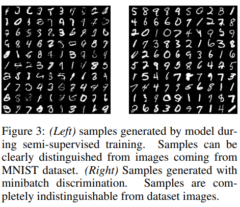

# \(2016\) Improved Techniques for Training GANs

## 1. Introduction

GAN은 Nash equilibrium\(내쉬 평형\)에 근거 게임이론에 의해 생성자와 분류자가 서로 최대의 이득을 얻기 위해 경쟁한다. 해당 논문에서는 이 과정에서 학습의 수렴이 매우 어렵게 되는데, 이를 해결하기 위한 여러 시도 중 유의미하였던 것들에 대해 소개한다.

* 내쉬 평형 : 상대방이 전략을 유지한다는 전제하에 자신도 현재 전략을 바꿀 이유가 없는 상태. 즉, 경쟁자의 대응에 따라 최선의 선택을 하면 서로가 자신의 선택을 바꾸지 않는 균형을 유지하는 상태를 말함.

## 2. Methods

### 2.1. Feature matching

기본적인 GAN의 Loss는 discriminator가 얼마나 잘 분류하냐로 정의되는데, 관점을 바꾸어 generator가 얼마나 real data에 유사한 분포를 학습할 수 있게 하는지를 loss로 바라보게 한다. 아래와 같이 수식이 변형된다.

$$
|| {f(x) - f(G(z))} ||
$$

여기서 f\(x\)는 real data x에 대한 판별함수이며, G는 input z에 대한 generator 모델링이다. 위와 같이 generator에 대한 새로운 loss 함수를 생성하는 데이터를 판별하는 것과 real data에 대한 판별하는 것의 차이로 정의하면, generator의 학습 방향이 real data의 분포의 모양으로 진행된다. 이렇게 loss 함수에 변형을 주는 것은 기존 GAN의 불안정한 학습에 대해 경험적으로 좀 더 나은 결과를 보여준다.

### 2.2. Minibatch discrimination

기존의 mini-batch 방식의 학습은 특히, GAN에서 discriminator가 단 방향의 잘못된 gradient descent를 할 가능성이 높다. 이렇게 되면 generator는 점점 학습하고자 하는 분포와 멀어지고 discriminator도 계속해서 잘못된 방향으로 학습한다. 문제는 mini-batch안에 있는 input을 discriminator가 독립적으로 처리하면서 발생하는데, 논문에서는 mini-batch안에 데이터들끼리의 관계성을 계산하여 학습식에 추가하였다. 관계성이라는 특성이 추가되어 input간의 차이를 좀 더 잘 알게되어 올바른 방향의 gradient를 학습하는데 도움을 준다.

### 2.3. Historical averaging

generator, discriminator에 아래와 같은 term을 추가하여 학습 동안 급격한 변화로 잘못된 방향의 학습이 진행되지 않게 해줌. theta는 각 모델의 파라미터이며, t는 현재 상태에서의 학습 epoch 또는 iteration.

$$
|| \theta-\frac{1}{t} \sum_{i=1}^t \theta[i] ||
$$

### 2.4. One-sided label smoothing

학습 시 label을 기존의 0, 1처럼 딱 떨어지는 숫자가 아닌, 0.1, 0.9와 같이 smoothing된 label을 이용함. GAN과 같이 학습이 불안정한 모델에서는 이와 같은 방식이 완전한 정답을 맞추는게 아니어서 안정성을 높여줌.

### 2.5. Virtual batch normalization

기존의 mini-batch로 학습하는 것이 아닌 고정된 reference batch를 사용해서 normalization을 시도함. 이렇게 하는 이유는 기존의 Batchnormalization에서는 input x가 같은 minibatch안에 있는 x'와 같은 다른 input에 종속적이게 되는 문제를 해결하기 위함임.

## 3. Experiment & Analysis

사람이 직접 이미지의 품질을 판단하여 분류하고 이를 이용해 GAN을 학습하면 생성된 이미지의 품질이 향상되는 결과를 보였다. 이런 현상이 발생하는 이유로 저자는 인간 시각 시스템이 각 객체를 분별하는데 있어 도움이 되는 부분을 잘 캐치해내고 필요없는 부분을 잘 걸러내어 공통적이고 필요한 부분만 통계적으로 접근되기 때문이라고 한다. 사람이 분류한 이미지대로 학습을 진행하면 실제 인간이 대상을 분류하는 것처럼 학습을 하게되어 동일한 특징을 갖는 이미지 분포를 얻기가 쉬워진다고 말하고 있다.

위는 논문에서 제안된 방법들을 합쳐 생성한 MNIST dataset이다. 생성된 이미지와 실제 이미지를 섞어 유저들에게 분류하게 시켰더니 52.4%정도만 분류에 성공했다. 동일하게 CIFAR-10으로 실험을 진행했고, 78.7%의 분류 정확도를 보였다.  

## References

* [https://arxiv.org/pdf/1606.03498.pdf](https://arxiv.org/pdf/1606.03498.pdf)
* [https://github.com/yjucho1/articles/blob/master/fromGANtoWGAN/readme.md\#improved-gan-training](https://github.com/yjucho1/articles/blob/master/fromGANtoWGAN/readme.md#improved-gan-training)

