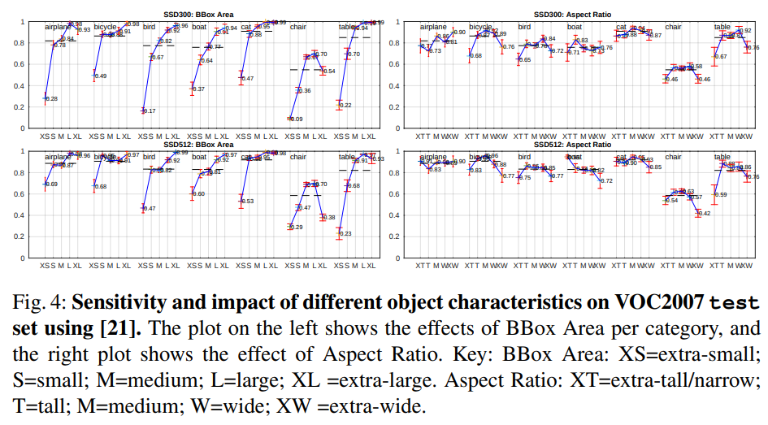

# \(2016\) SSD: Single Shot MultiBox Detector

## 1. Introduction

일반적인 2 stage object detection model\(Detection -&gt; Classification\)들은 정확도는 좋으나 이 당시 가장 빠르다고 나왔던 Faster-RCNN의 경우도 FPS가 겨우 7밖에 되지 않았음. 처리속도가 너무 느려 빠르게 하고자 하는 시도가 많았는데, 속도와 정확도의 trade-off가 꽤 심했음.

이 논문에서는 YOLO와 같은 1 stage detection model을 선보이면서, 속도 대비 정확도를 최상급으로\(mAP 73.2%, 59 FPS for VOC2007\) 만드는 방법을 소개한다.

### Contributions

* Single shot detector 중 가장 좋은 성능을 보임.
* 다양한 scale의 feature map으로부터 multi scale prediction을 가능하게 한다.\(Bounding box 후보 크기가 다양함\)
* Bounding box proposal을 제거해서 속도를 올림.
* Small convolution filter로 category score를 계산함.

## 2. Model Architecture

### 2.1. Model

SSD의 기본 모델 구성은 위와 같다. VGG-16 model을 backbone으로 사용하여 특정 Conv output들로부터 bounding box를 추출하여 low-level에서 high-level feature로 가면서 다양한 크기의 bounding box 위치를 고려한다. \(이 말은 multi-scale object detection을 고려한다는 의미와 같다.\) SSD에서는 총 6군데의 feature map에서 추출하게 되며 아래의 그림과 같이 고정된 영역을 bounding box로써 살펴본다.

### 2.2. Default boxes and Aspect ratios

위 그림처럼 SSD의 bounding box는 이전의 다른 모델들과 다르게 conv layer의 feature map\(HxW\)의 크기대로 볼 수 있다. 예를 들면, \(b\)의 8x8 feature map을 보면 input image의 크기가 224x224라고 할 때 feature map의 1 pixel은 입력 이미지에서 28 픽셀만큼의 영역을 의미한다. 그래서 SSD에서는 각 feature map의 1개의 pixel을 cell이라 부르고 1개의 cell에 대해 aspect ratio를 다양하게 주어 cell 당 다양한 모양의 bound box를 생성한다. 이 방식으로 object의 후보를 생성하면 논문 기준으로 300x300 크기의 입력 이미지로 8,732개의 박스를 생성한다.

좀 더 자세히 알아보기 위해 아래의 외부 이미지를 통해 설명하면,

각 Conv Layer에서 3x3 크기 convolution filter를 "bound box 갯수 X Class 수 X Offset" 만큼 channel을 두어 category score를 추출한다. 각 conv layer에서 추출되는 bound box 수는 아래 그림과 같다.

위의 각 conv layer에서의 Bounding box 수는 aspect ratio에 따라 결정되며 aspect ratio 값에 따른 다양한 box offset 정보를 생성한다.

## 3. Learning Strategy

### 3.1. Matching strategy

Ground truth box들과 Default box들\(conv layer에서 추출된 기본 박스들\)의 IoU\(a.k.a. Jaccard overlap\)이 0.5 이상인 것들만 취급한다. \(IoU가 낮다는 것은 실제 object가 있는 곳과 너무 동떨어져서 의미가 없기 때문\)

### 3.2. Training objectives

SSD의 Loss 구성은 다른 Object detection model과 동일하게 Confidence와 Location 부분으로 나뉘어진다.

Confidence의 경우 softmax loss로 간단하게 계산이 된다.

Location Loss는 Faster RCNN에서 나온 smooth L1 loss를 이용하는데, 추정된 Location \(center X, Y, Width, Height\)에 대해 Groundtruth의 각 Center X, Center Y, Width, Height와의 차이 값으로 계산한다. Location Loss의 식은 아래와 같다.

$$
L_{loc}(x,l,g) = \sum_{i} \sum_{m} x_{ij}^k smooth_{L1}(l_{i}^m-\hat{g_{j}^m})
$$

* x는 category k에 대한 groundtruth 확률값
* l은 추정된 box 중 i번째의 m\(CX, CY, W, H 중 하나\) 
* g는 groundtruth box 중 j번째의 m\(CX, CY, W, H 중 하나\) 값

따라서, Conf와 Loc의 Loss 합은 다음과 같이 나타낸다.

$$
L(x,c,l,g)=\frac{1}{N}(L_{conf}(x,c) + \alpha L_{loc}(x,l,g))
$$

* N은 prediction된 box의 갯수. \(N=0이면, loss는 0으로 처리. update가 필요없으므로\)
* alpha 값은 논문에서는 cross validation을 통해 1로 설정하였음.

Loss의 업데이트는 위의 matching strategy에서 얻어진 predicted box들에서만 update 되므로, 그 외 box들은 무시된다. \(좀 더 정확한 update를 위해 필요한 것만 update\)

### 3.3. Choosing scales and aspect ratios for default boxes

한 개의 Network에서 multi layer의 feature map들로 다양한 크기의 object를 학습할 수 있게 방법을 제시함. aspect ratio의 선택이 가장 중요해보이는데, 임의로 바꾸면 성능이 떨어짐. 문제마다 이를 최적화하면 더 좋을 듯.

$$
s_k = s_{min} + \frac{s_{max} - s_{min}}{m-1}(k-1), k \in [1,m]
$$

* K : feature map을 추출하는 Layer의 수
* s : scale parameter
  * min : 최소 크기
  * max : 최대 크기
  * Layer마다 scale 범위를 정규화하기위해 저렇게 수식을 사용

$$
a_r \in \{1,2,3,\frac{1}{2},\frac{1}{3}\}
$$

* a : aspect ratios \(Box의 가로, 세로 비율 조정용\)

$$
w_{k}^a = s_k \sqrt{a_r}, h_{k}^a = s_k /\sqrt{a_r}
$$

* w : scale과 aspect ratio를 반영한 box의 width
* h : scale과 aspect ratio를 반영한 box의 height

### 3.4. Hard negative mining

Matching까지 끝나고나면, 상당히 많은 box들이 negative 샘플이 되는데, 이것들을 전부 사용하면 학습에 도움이 안된다. 그래서 Confidence로 내림차순으로 정렬하여 Negative와 Positive가 3:1이 되도록 추출해서 학습에 사용한다. 이 방식으로 진행하면 optimization이 더 빠르고 학습도 더 안정적이라고 주장한다.

### 3.5. Data augmentation

Data augmentation을 다음과 같은 순서로 진행된다.

1. Sample patch in original image
2. resize to fixed size
3. horizontally flipped with prob of 0.5
4. photo-metric distortion

패치 샘플링의 경우 다음 중 하나를 택하여 선택된다.

* 전체 이미지 크기
* sample된 patch의 minimum IoU가 object의 0.1, 0.3, 0.5, 0.7, 0.9 중 하나
* 그냥 무작위 sample patch

sample patch의 크기는 원본 크기의 0.1에서 1배\(원본크기\)만큼 중 하나로 선택된다.

## 4. Experimental Results

### 4.1. Base Network

저자들은 VGG16 모델을 기본으로 사용하였고 일부 layer에 변형을 주었다.

* DeepLab-LargeFOV를 참조하여 fc6, fc7의 layer를 Conv layer로 변경
* pool5의 parameter를 2x2-s2 에서 3x3-s1으로 변경
* atrous algorithm 적용
* dropout 및 fc8 layer 제

### 4.2. Model Analysis

SSD는 Faster RCNN같은 2 Stage 모델보다 Localization Error가 작음. \(object shape을 직접적으로 regress하고, object category를 분류하기 때문\) 하지만, 비슷한 category들 사이에서는 성능이 떨어짐.

또한, SSD는 small object를 검출에 대해서는 약한 모습을 보임. 그래서 Input을 300에서 512로 늘리면 좀 더 잘 찾아짐. \(그래도 근본적으로 small object에 대해 feature가 약하기 때문에 검출이 잘 안됨\) 반면, large object에 대해서는 잘 찾음. \(아래 그림처럼 box 크기에 따라 성능이 크게 좌우됨\)

Model 성능 점검을 위해 다양한 방식으로 SSD성능을 점검함.

* Aspect ratio에서 2와 3을 넣느냐 안 넣는냐는 성능차이가 크게 난다.
* Atrous algorithm은 속도 측면에서 큰 도움이 된다.
* Multi layer에서 추출하는 feature들이 resolution을 cover하는데 큰 도움이 된다. \(저자들이 실험을 통해 각 layer들을 제거하면서 했을 때, mAP가 74.3에서 62.4까지 떨어짐을 확인함.\)
* Augmentation 시 Zoom In, Zoom Out을 통해 small object 분류 정확도를 향상시킴.
  * Zoom in으로 small object를 large object로 변환
  * Zoom out으로 large object를 small object로 변

결론은 이 당시 속도도 제일 빠르고, 성능도 거의 Top임.

## References

* [https://taeu.github.io/paper/deeplearning-paper-ssd/](https://taeu.github.io/paper/deeplearning-paper-ssd/)
* [https://arxiv.org/pdf/1512.02325.pdf](https://arxiv.org/pdf/1512.02325.pdf)

