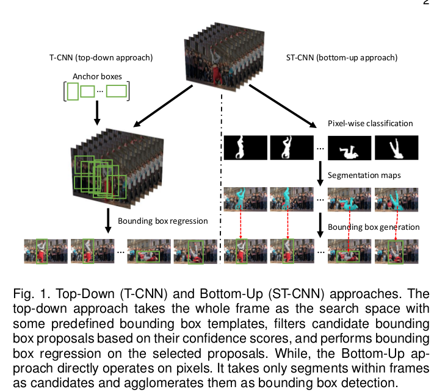
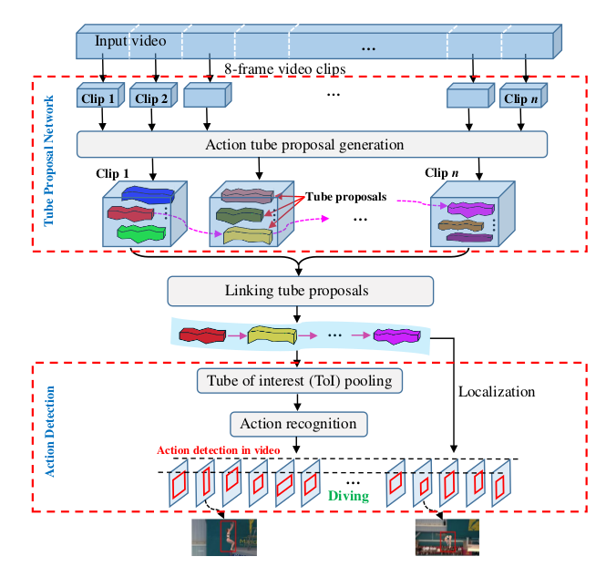
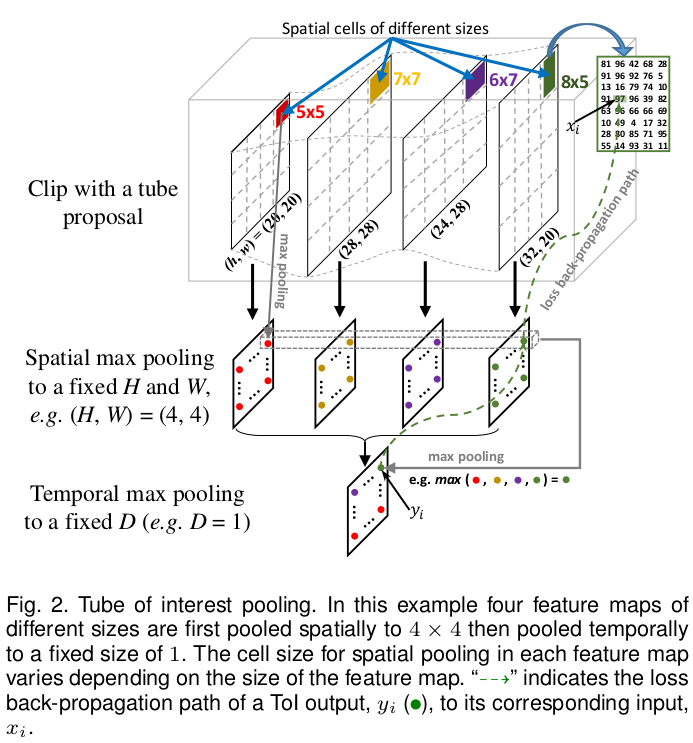
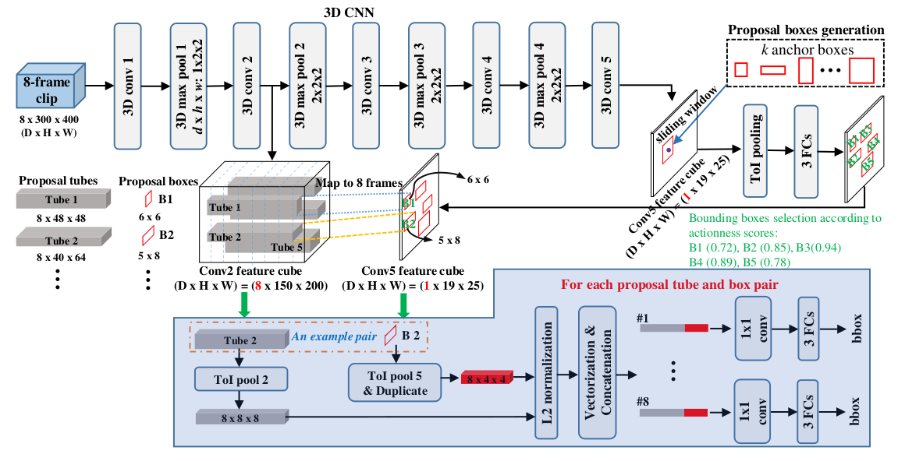
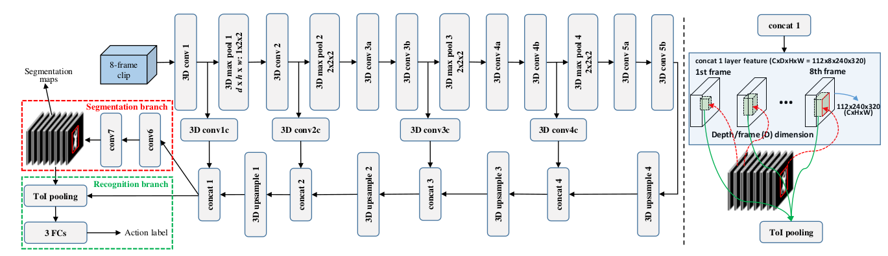
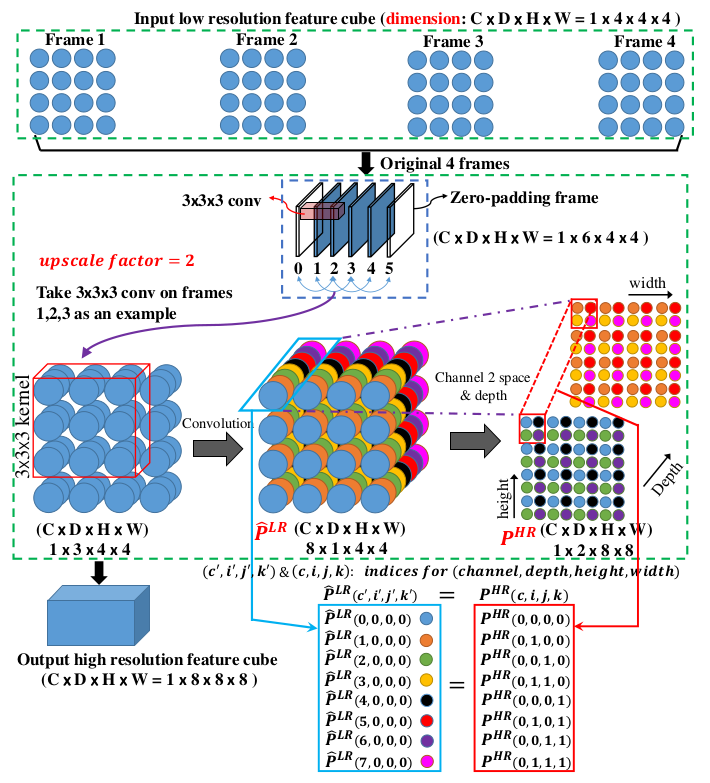
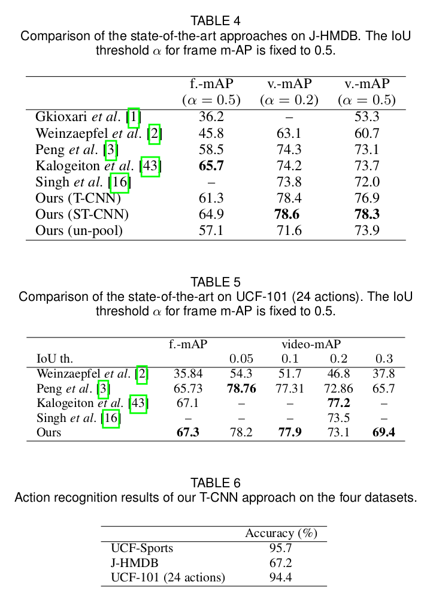
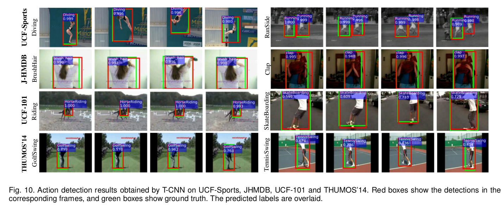

# \(2017\) CNN for Action Detection and Segmentation in Videos

## 1. Introduction

* 기존 R-CNN 기반의 Top-down 방식은 video에서의 action detection을 하기에는 시간적인 부분을 잘 고려하지 못함.
* Top-down 방식은 CNN을 거쳐 후보 region들을 찾고, 그 영역들에 대해 anchor box와 맞는지 regression 과정을 거침. \(많은 데이터 필요, 정확도 낮음\)
* 반면, Encoder-Decoder형식의 Segmentation과 같은 Bottom-up 방식은 pixel 단위의 분류를 통해 더욱 정교한 bbox 검출 가능. \(pixel 단위의 샘플 분류로 데이터도 더 적어도 됨. video annotation의 단점 줄임\)
* 여기에 시간적 일관성을 고려하기 위해 3D convolution 기반의 T-CNN, ST-CNN을 제안함.

## 2. Methods

### 2.1. T-CNN

* 3D convolution 기반으로 기존의 Channel X Height X Width에서 시간 정보\(Depth or Time or Frame\)을 추가하여 시간정보도 고려함.
* 8 frame단위를 묶어 하나의 clip이라는 단위로 입력을 받으며, 이러한 처리는 GPU 효용성을 높여줌.
* 하지만, 이러한 3D convolution 과정에서 시간정보가 희석되기 때문에 ToI\(Tube of Interest\) Pooling layer를 제안하여 시간 일관성을 유지시키고 고정된 크기의 feature vector를 추출하도록 함.
* 시간 일관성은 skip pooling layer를 두어 유지함.
* ToI pooling의 Backpropagation은 un-pooling layer와 같이 max-pooling한 위치를 기억하여 이를 역추적하여 계산함.

* Anchor bbox 추출 시, K-means clustering을 사용하여 12개의 후보를 추출함.
* Bbox는 GT와의 IoU가 0.7이상이거나, bbox 중 IoU가 가장 높은 것을 제외하고 제거함. 추가로, bbox의 행동점수가 threshold보다 낮을 경우도 제거함.
* T-CNN에서 말하는 Tube\(연속된 시간에서의 Action or foreground라고 할 수 있을 듯\)에 대해 전체 video에 대한 score는 아래와 같이 정의한다. 여기서 actionness\(행동점수\), overlap\(j번째 tube의 마지막 frame과 j+1번째 tube의 첫번째 frame 사이의 IoU\)를 평균이 video action score가 된다.
* bbox의 loss는 conv5에서 추출한 후보 bbox를 시간일관성을 고려하기 위해 conv2에서 추출한 후보에 연결하여 L2 norm으로 계산한다.

$$
S=\frac{1}{m} \sum_{i=1}^m Actionness_i + \frac{1}{m-1} \sum_{j=1}^{m-1} Overlap_{j, j+1}
$$

### 2.2. ST-CNN

* T-CNN을 Encoder-Decoder 구조로 확장시켜 Segmentation task에 적용 가능하게 함.
* un-pooling, deconvolution이 아닌 sub-pixel convolution을 통해 upsampling을 수행함.
  * upsampling하기 위한 tube의 양 끝에 zero-padding 삽입
  * 0-2, 1-3 frame씩 3개를 묶어 convolution 수행
  * resolution은 같지만, depth가 3에서 1로 바뀌며 channel수가 늘어남\(1-&gt;8\)
  * 늘어난 channel정보를 reshape하여 resolution과 depth에 분산시킴\(논문에 등장하는 eq. 3, 4을 이용하여\)

## 3. Results & Conclusion

* UCF-Sports, J-HMDB, UCF-101, THUMOS'14, DAVIS'16 등의 데이터셋으로 학습 + 테스트 진행.
* 입력 resolution은 300 X 400으로 고정.
* 일부 T-CNN이 좋은 dataset도 있긴하나 대부분의 경우 ST-CNN이 가장 좋은 성능을 보임.
* T-CNN은 100k batches 후 학습 종료, ST-CNN은 500k batches 후 학습 종료.
* Titan X 1개 사용으로, 40 frame 비디오에 대해 T-CNN은 2.03초, ST-CNN은 0.7초로 ST-CNN이 3배 가량 빠름.
* Video segmentation을 End-to-end + 시간 일관성을 고려한 점에서 좋은 approach인 것 같음. 쓸데없이 많은 과정을 거치지않고 필요한 연산만하여 parameter도 많이 크지 않을 것 같음.

## References

* [https://arxiv.org/abs/1712.01111](https://arxiv.org/abs/1712.01111)

