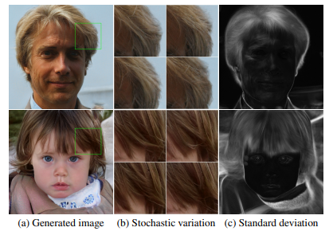

# 작성중 \(2018\) StyleGAN

## 1. Introduction

기존 GAN에서는 random noise input \(latent space\)가 특정 분포 \(ex - uniform\)을 따르기 때문에 다양한 변화를 갖는 dataset에 대해 제대로 된 output을 내기 어려웠다. 제안된 논문에서는 아래와 같은 점들을 추가하여 Style을 적절하게 반영한 HD 이미지를 output으로 만들 수 있게 하였다.

* Immediate latent space : random noise vector를 또다른 분포로 변화시키는 network를 거쳐 단순한 하나의 분포가 아닌 다양한 분포를 통해 이미지 생성이 가능하게 만듦
* Input layer의 입력값 고정 : Vanilla GAN에서는 input을 random noise를 받았지만, immediate latent vector를 사용하는 style GAN에서는 input layer에 random한 값을 넣는 것이 의미 없어 constant vector를 사용함
* random noise : upsampling하는 각 layer에서 random noise를 더해주어 stochastic한 변화를 더해

## 2. Architecture & Properties

Style GAN의 모델 구조는 위와같다. \(a\)의 Vanilla GAN과 다르게 기존의 input으로 사용하던 random noise vector를 Immediate latent space로 변화시키는 FC로만 구성된 network의 input으로 사용한다. 이렇게하면 고정된 분포의 input을 다양한 모양의 분포 vector로 변화를 주어 output이 갖는 변화의 다양성이 커지게 된다. 추출된 Immediate latent vector는 다양한 변화를 갖기때문에 Synthesis network의 각 layer마다 style을 주는데 사용된다.

각 layer에 존재하느 Adaptive InstanceNorm module은 Immediate latent vector를 반영하고자하는 style의 형태로 변화를 준다. 또한, 각 layer에서는 random noise를 추가로 주어 Style의 세부적인 부분을 stochastic한 변화를 주게 한다.

Style GAN의 synthesis network는 input값이 고정으로 Constant tensor로 되어있는데, immediate latent vector로 style을 줄 때, input layer에서 random noise와 합쳐지는 것이 good quality의 output을 얻는 것에 큰 도움을 주지 않아 제거했다고 한다.

Up/Down sampling 과정에서 기존 GAN에서는 Pooling 방식을 이용하였는데 bilinear sampling을 도입하여 좀 더 깔끔한 output이 나오도록 변경하였다.

마지막으로 mixing regularization을 도입하여 layer간 style correlation을 줄이도록 하였다. mixing regularization은 immediate latent space를 생성하는 input인 latent code를 2개를 사용하여 처음부터 중간은 1번 latent code를 이용하여 학습하다 중간에 2번 code로 변경하여 학습하면 layer간 style이 correlated하지 않게 되어 다양한 style학습에 방해를 없애준다.

## 3. Experimental Results & Conclusion

### 3.1. asdasd

### 3.2. Stochastic Variation

dfdf

