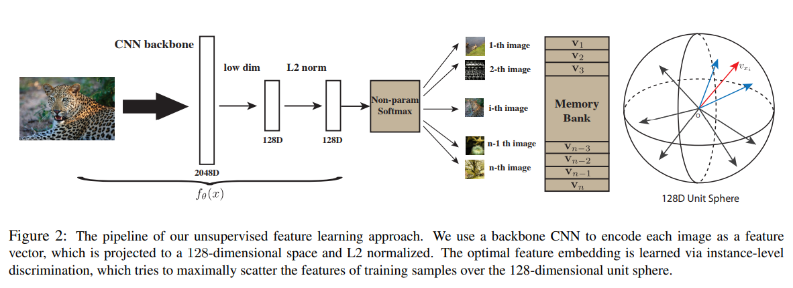
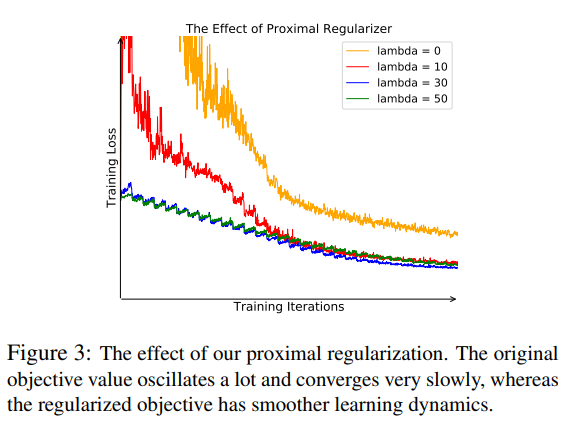
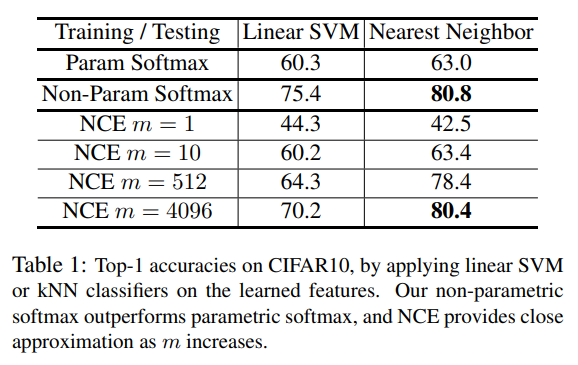

# \(2018\) Unsupervised Feature Learning via Non-Parametric Instance Discrimination

## 1. Introduction

* 기존 softmax에 noise-contrastive estimation\(NCE\)를 더해 학습 안정화를 
* Unsupervised learning의 성능 측정을 위해 kNN, SVM과 결과 비교
* non-parametric approach로 instance로부터 측정한 feature들을 memory bank에 저장
* 128크기의 feature만 추출하기 때문에 100만 단위 이미지에도 600MB만큼의 메모리만 사

## 2. Methods

### 2.1. Non-parametric Softmax Classifier

* 기존의 softmax classifier는 parametric method로 raw data X로부터 feature vector v를 추출하여 weight vector w로 해당 클래스로 매칭된다
* 이런 방법들은 weight vector에 의해 instance 간 비교를 무시하게 된다
* 그래서, non-parametric방법으로 변환하여 weight vector를 없애고 feature vector로 L2 norm을 계산하여 하나의 probability로써 기능하게 한

### 2.2. Memory Bank

* feature vector v는 모든 이미지에 대해 매번 계산되어야 함
* 하지만, 이런 계산은 낭비이므로 미리 그만큼의 공간을 할당하고 unit random vector로 초기화
* memory bank에서의 vector와 모델을 통해 나온 feature vector가 같다고 보고 이를 학습
* memory bank를 사용함으로써 weight vector는 계산하고 gradient를 따로 저장할 필요가 없어

### 2.3. Noise-Contrastive Estimation

* Non-parametric 방법은 class 수가 늘어날수록 cost가 매우 커짐
* 이를 해결하기 위해 hierarchical softmax, negative sampling, NCE등이 있음 \(여기서는 NCE 채택\)
* 기본 idea는 multi-class를 binary class로 생각하는 것\(wanted data class와 noise data classes\)

$$
P(i|\mathbf{v}) = \frac{ \exp(\mathbf{v}_ j^T \mathbf{f}_i / \tau) }{Z_i}, \quad Z_i=\sum_{k=1}^n \exp( \mathbf{v}_ j^T \mathbf{f}_i / \tau)
$$

$$
h(i, \mathbf{v}):=P(D=1|i,\mathbf{v}) = \frac{P(i|\mathbf{v})}{P(i|\mathbf{v}) + mP_n(i)}
$$

$$
J_{NCE}(\theta) = -E_{P_d} [\log h(i, \mathbf{v})] -m\cdot E_{P_n} [\log (1-h(i, \mathbf{v}'))]
$$

* Z 는 normalization을 위한 constant value
* v 는 memory bank vector
* f 는 모델로 추출한 feature vector
* P 는 prior
* Posterior probability of sample i : h\(i, v\)

### 2.4. Proximal Regularization

* 클래스 당 많은 instance를 갖는 기본 classification과 다르게 제안된 방법은 클래스 당 1개의 instance만을 학습에 사용하여 learning process가 많이 불안정함\(loss curve가 oscillation\)
* proximal optimization을 추가하여 안정화 작업을 수행

$$
-\log h(i, \mathbf{v}^{(t-1)}) - \lambda|| \mathbf{v}_i^{(t)}-\mathbf{v}_i^{(t-1)}  ||_2^2
$$

* 기존 memory bank에 있던 feature와 새롭게 업데이트된 memory bank를 이용하여 차이값을 regularization으로 사용

$$
J_{NCE}(\theta) = -E_{P_d} [\log h(i, \mathbf{v}^{(t-1)}) - \lambda|| \mathbf{v}_i^{(t)}-\mathbf{v}_i^{(t-1)}  ||_2^2] -m\cdot E_{P_n} [\log (1-h(i, \mathbf{v}'^{(t-1)}))]
$$

## 3. Results & Conclusion

* 제안한 방법의 테스트는 학습한 모델로 추출한 trainset의 feature vector들로 SVM을 학습하고 testset의 feature vector를 분류함
* k-nearest는 학습이 필요없어 그대로 진행

* 작은 크기의 feature vector로도 generalization이 잘됨
* training과 testing에서의 objective\(similarity\)가 일관성 있음. 즉, 성능이 좋음
* trainset이 많을 수록 성능 좋음
* embedding size는 resnet18, imageNet 기준 128보다 커지면 saturation
* memory bank를 사용하여 메모리 효율적인 학습법이 인상깊음
* instance 단위를 class로 보아도 유사한 데이터끼리는 모인다는 점이 흥미로움

## References

* [https://arxiv.org/abs/1805.01978](https://arxiv.org/abs/1805.01978)

