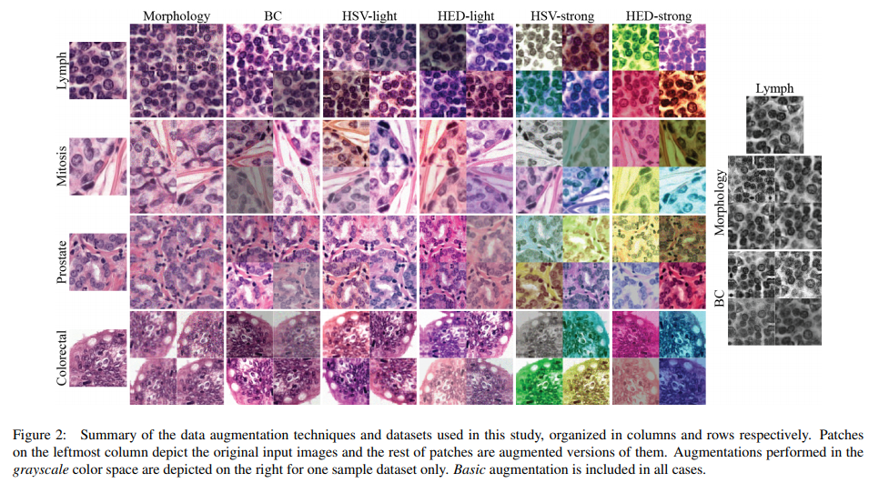

# \(2019\) Data augmentation for Pathology

## 1. Introduction

* Pathology Image는 Laboratory마다 염색법이 달라 통일성이 부족하여 AI학습에 좋지 않음.
  * Stain Color Augmentation : 염색법이 다른 것을 augmentation으로 해결하고자 함.
    * Morphological : Rotation, Flip, Mirroring, Scaling, Elastic Deformation, Additive Gaussian noise, Gaussian blurring
    * Color Transformation : Contrast, Hue perturbation
  * Stain Color Normalization : 다른 염색법들을 정규화하여 차이 폭을 줄이는 방법. \(Train과 Testset 사이의\)
    * Deconvolution
    * GAN

아래는 조직/염색법 마다 다른 pathology image.

### Contributions:

* CNN 분류 성능에 미치는 영향을 정량화
  * 잘 알려진 stain color augmentation/normalization 알고리즘을 사용
* 4가지 Task에 대해 9개의 Multi-center 평가를 진행
  * Mitosis detection
  * Tumor metastasis detection in lymph nodes
  * Prostate epithelium detection
  * Multiclass colorectal cancer tissue classification
* Unsupervised image-to-image translation으로 stain color normalization을 공식화 및 모델 학

## 2. Materials

### 2.0. 기본 정보

* Radboud University Medical Centre \(Radboudumc or rumc\)의 데이터만을 학습에 사용하고 나머지 센터의 데이터는 테스트 용으로 사용했다.
* RGB 패치는 128x128 로 추출했다.

### 2.1. Mitotic figure detection

* 분열을 하고 있는 세포를 검출하는 것으로 이진류 문제이다.
* TUPAC Challenge에서 받아올 수 있는 public 데이터이다.
* 0.25 µm/pixel resolution

### 2.2. Tumor metastasis detection

* metastatic tumor cell 을 포함하고 있는지 분류하는 이진분류 문제이다.
* Camelyon17 Challenge 에서 얻을 수 있는 public 데이터이다.
* t 0.25 µm/pixel resolution

### 2.3. Prostate epithelium detection

* prostate\(전립선\) 조직에 epithelial\(상피\) 세포가 있는지 분류하는 이진분류 문제이다.
* 요것도 공개되어 있고.

### 2.4. Colorectal cancer tissue type classification

* 9개의 colorectal cancer \(CRC\)를 분류하는 문제이다.
  * 1\) tumor, 2\) stroma, 3\) muscle, 4\) lymphocytes, 5\) healthy glands, 6\) fat, 7\) blood cells, 8\) necrosis and debris, and 9\) mucus.
* 0.5 µm/pixel resolution
* 요 테스트 에선 따로 2개의 데이터셋을 추가로 사용.

### 2.5. Multi-organ dataset

* stain color normalization 문제를 풀기위한 네트워크를 학습시기기 위해, 앞서 말한 데이터를 통합해서 만들었다.

## 3. Methods

다음과 같은 기법들을 적용하여 학습을 진행함.

### 3.1. Stain Color Augmentation

* Basic
  * 90 degree rotations
  * Vertical/Horizontal Mirroring
* Morphology \(extended basic\)
  * Scaling
  * Elastic deformation
  * Additive Gaussian noise
  * Gaussian blurring
* Brightness & contrast \(BC - extended Morphology\)
  * Random brightness / contrast perturbations
* Hue-Saturation-Value \(HSV - extended BC\)
  * Random shifting Hue & Saturation
* Hematoxylin-Eosin-DAB \(HED - extended BC\)
  * 3 steps
    * Hematoxylin과 Eosin color channel을 Fixed matrix를 사용한 Color deconvolution의 평균으로 분리
    * H와 E를 독립적으로 perturbation
    * RGB color space로 재변

### 3.2. Stain Color Normalization

Trainset과 Testset 간의 Color variation을 줄이는 방법. 아래와 같은 방법들로 진행된다.

* Identity : 변화 없이 그대로 사용.
* Grayscale : RGB 이미지를 흑백 영상으로 변환. H&E Color 정보가 대부분 사라지고, Shape이나 Texture 등의 정보만 남는다.
* LUT-based : Look Up Table에 Target WSI의 color 정보를 담아 Normalization을 수행.
* Network-based : U-Net을 End-to-end으로 Color distribution을 변환하는 모델을 학습.

## 4. Experimental Results

## 5. Conclusion

Link : [https://arxiv.org/pdf/1902.06543.pdf](https://arxiv.org/pdf/1902.06543.pdf)

