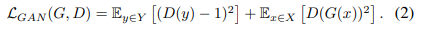

# 작성중 \(2019\) Gated-GAN

## 1. Introduction

Content 이미지를 input으로 multi style 이미지를 생성하도 학습하는 GAN이다. 특이하게 다양한 style을 학습하기 위해 단일 GAN 내부 encoder와 decoder 사이 Transformer module이라는 것을 추가하여 gate를 열고 닫듯이 style을 정하여 학습 및 생성하도록 하였다. 논문의 주요 contribution은 다음과 같다.

* Gate module을 추가하여 단일 모델에서도 multi style learning이 가능하게 함
* Gate module을 이용하여 input과 output 사이에의 consistency를 없애 auto-encoder형태에서 탈피하여 mode collapse를 회피함
* Real/Fake의 기존 GAN부분과 Auxiliary classifier를 두어 overlaid-gradient problem 회피

주석\) mode collapse : random input이 다양한 변화를 주는 output을 생성하지 못해 GAN을 통해 생성한 output 이미지가 동일한 형태가 나오는 것을 의미

## 2. Methods

### 2.1. Architecture

Network구조는 아와 같으며 gate마다 style을 다르게 줄 수 있도록 학습한다. 이 구조를 통해 encoder, decoder 파라미터는 공유하고 gate module만 style 수만큼 추가하여 효율적인 형태로 1개의 network로 multi style을 적용할 수 있게 하였다. 또한, Gated GAN에서는 Discriminator에서 Real/Fake를 분류하는 기존의 GAN 부분과 Auxiliary Classifier를 두어 Style 종류를 맞추는 2가지 output으로 나뉜다. LabelGAN처럼 이 두 부분을 합치는 경우도 있지만 이렇게하면 Overlaid-gradient problem이 발생해 학습에 안좋은 영향을 주게된다.

### 2.2. Loss 구조

Vanilla GAN의 문제점들을 해결하기 위해 다양한 Loss 구조를 도입함

* LSGAN으로부터 least squares loss 도입
* 학습 안정화를 위한 auto-encoder reconstruction loss 도입
* Overlaid-gradient problem 회피를 위한 AC-GAN Loss 도입
* 생성된 이미지가 smooth하게 하기 위해 Total variation loss 도입

**Least squares loss**

LS loss는 Discriminator의 gradient가 smooth하고 saturating 되지 않도록 도움을 준다.

**Auto-encoder reconstruction loss**

Mode collapse가 발생하는 주요 이유인 encoder와 decoder 사이의 consistency와 다양성 문제를 해결하기 위해 encoder와 decoder 부분을 input이미지와 상관없는 값을 통해 update 해주는데 사용하낟.

**AC-GAN loss**

Multi style 학습 시 발생하는 overlaid-gradient problem으로 인해 학습이 불안정해지는 것을 해결하기 위해 Real/Fake 분류와 Style 분류를 독립적으로하여 해결하도록 한다.

**Total variation loss**

생성된 이미지의 변화가 자연스럽도록 변화에 대한 loss를 추가하여 smooth하게 도와준다.

## 3. Experimental Results & Conclusion

