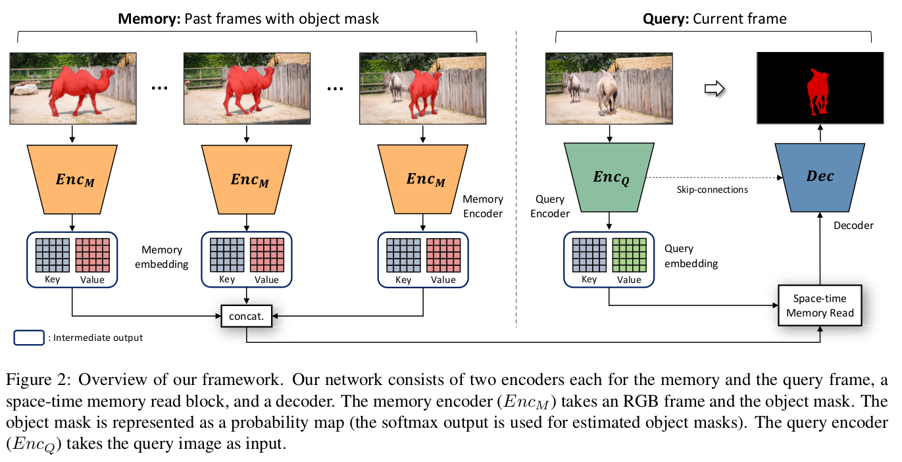
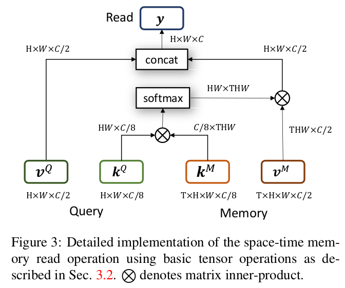
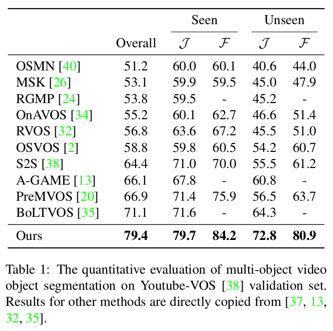
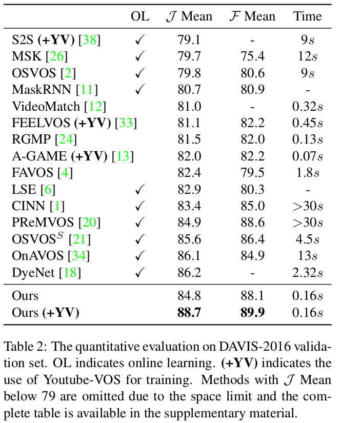
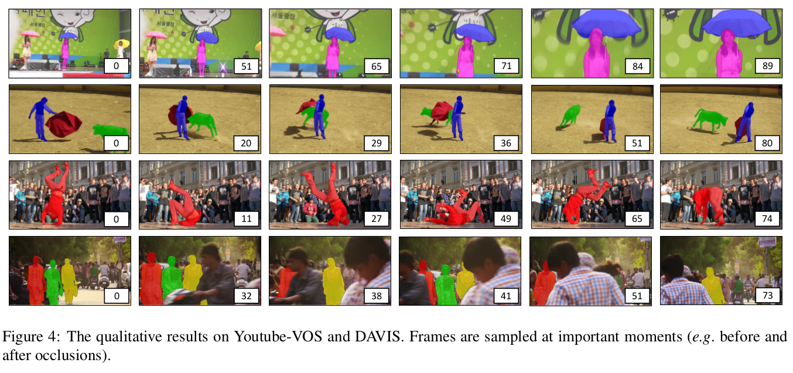

# \(2019\) Video Object Segmentation using Space-Time Memory Networks

## 1. Introduction

* Video object segmentation은 다음과 같은 방법들이 있음
  * 이전 frame만 참고 : 변화에 더 잘 적응하고, occlusion에도 강건함
  * first frame만 참고 : 위에 것과 반대
  * 이전 + first frame 참고 : 위 둘의 장점을 합침. 정확도 + 변화에 잘 적응
* 제안한 방법의 이점
  * 별도의 Memory에 각 frame에서의 foreground 정보를 저장하고 업데이트하여 사용
  * 참조 frame 수의 제한이 없어짐
  * non-local spatial pixel matching을 적용하여 더 정확한 segmentation 가능
  * 많은 frame을 참조 가능하여 occlusion, 형태 변화 등에 강함

## 2. Methods

### 2.1. Space-Time Memory Network

* Memory Network 도입
  * Key - Value pair memory를 두어 현재 frame에서의 object를 다른 frame에서의 시공간에서 찾기 유용함
  * Key는 Backbone network의 feature map 채널의 1/8크기
  * Value는 Backbone network의 feature map 채널의 1/2크기
  * Query : 현재 frame에 대한 output 정보
    * 입력값 : only image
    * Key : 유사 object가 언제\(time\), 어디\(space\)에 존재하는 지\(value\)를 나타냄
    * Value : Visual semantic 정보를 담은 feature map
  * Memory : 과거 frame들에 대한 output 정보
    * 입력값 : image + mask
    * Key : 유사 object가 언제\(time\), 어디\(space\)에 존재하는 지\(value\)를 나타냄
    * Value : Visual semantic + predicted mask 
* Encoder에서 Memory를 multi input\(multi frame\)으로 가져올 때는 독립적으로 각 frame을 처리하여 stack을 쌓음

### 2.2. Space-time Memory Read

* Query와 Memory의 key값의 유사도를 먼저 측정하고 이를 이용하여 Memory의 value값에서 가장 유사한 특징들을 추출함
* 추출된 특징들을 Query의 Value와 concat하여 최종 memory read를 진행
* 일련의 과정은 Non-local Neural Networks의 방법과 거의 같음\(확장형\)
  * 유사도 측정은 Embedded gaussian function 사용
  * self attention이 아닌 유사한 frame의 위치 + object를 찾기 위함임

### 2.3. Decoder

* 해당 [논문](http://openaccess.thecvf.com/content_cvpr_2018/papers/Oh_Fast_Video_Object_CVPR_2018_paper.pdf)의 decoder를 그대로 사용
* Multi-object segmentation은 각 object에 대해 probability map을 추출하여 stack후 winner-takes all 전략을 사용하여 표현

### 2.4. Training

* pre-training은 image로 진행
  * 연속된 frame이 아니어도 참고할 수 있기 때문에 warmup용
* main-training은 video로 진

## 3. Results & Conclusion

### 3.1. Datasets

* Youtube-VOS : 4453 videos
* DAVIS
  * 2016 : 20 videos
  * 2017 : 30 videos

### 3.2. Results

* Occlusion과 Appearance changing에 상당히 강한 면모를 보임
* Memory network + Non-local manner의 방법을 같이 사용한 것이 좋은 선택이었던 것 같음
* 참조할 frame수도 적절하게 조절 가능하여 성능 조절에 좋을

## References

* [http://openaccess.thecvf.com/content\_cvpr\_2018/papers/Oh\_Fast\_Video\_Object\_CVPR\_2018\_paper.pdf](http://openaccess.thecvf.com/content_cvpr_2018/papers/Oh_Fast_Video_Object_CVPR_2018_paper.pdf)
* [https://github.com/seoungwugoh/STM/blob/master/dataset.py](https://github.com/seoungwugoh/STM/blob/master/dataset.py)
* [https://arxiv.org/abs/1904.00607](https://arxiv.org/abs/1904.00607)

