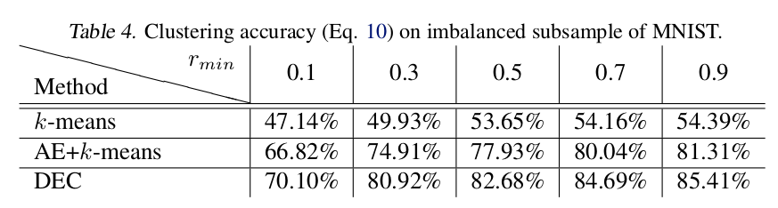

# \(2015\) Unsupervised Deep Embedding for Clustering Analysis

## 1. Introduction

* Data analysis와 Visualization에서 Clustering은 핵심적인 기술임
* Clustering algorithm에서 distance와 dissimilarity는 중요
  * Distance는 Data -&gt; Feature space로 표현하는데 중요함
  * Distance를 정의하기 위한 dissimilarity를 측정하는 것도 중요함

### Contributions

* Soft cluster assignment로부터 auxiliary target distribution으로 iteratively하게 clustering을 optimization
* Hyperparameter 선택에 sensitive하지 않음
* Clustering + Feature representation 동시 학습 진

## 2. Methods

* Raw data X에서 feature space Z로 embedding. \(이 때, 차원의 저주를 피하기 위해 훨씬 작은 dimension을 갖음\)
* 전체적인 Algorithm Flow
  * Autoencoder 모델로 feature space Z를 추출하고
  * K개의 cluster에 대해 auxiliary target distribution 사이의 Kullback-Leibler divergence를 최소화시키는 방향으로 parameter update

### 2.1. Soft Assignment

* Raw data X에 대해 embedding Z\_i를 추출하고 Centroid U\_i와 비교하여 i번째 clustering에 속할 확률을 계산함
* 자유도 알파 값은 별도의 cross-validation을 진행하지 않으므로 1로 설

$$
q_{ij} = \frac{ {( 1 + {|| z_i - \mu_j ||}^2 / \alpha )}^{-\frac{\alpha + 1}{2}} }{ \sum_{j'}{( 1 + {|| z_i - \mu_{j'} ||}^2 / \alpha )}^{-\frac{\alpha + 1}{2}} }
$$

### 2.2. KL Divergence minimization

* Soft assignment q와 auxiliary distribution p와의 KL을 계산함
* P의 선택이 제안한 논문의 알고리즘 성능에 중요한 역할을 담당함
  * 단순하게는 confidence threshold로 그 이상의 값들만 취하여 만드는 법이 있음
  * 하지만 soft assignment를 이용하고 있으므로 확률값인 p도 인위적인 값이 더 자연스러운 방법이기 때문에 이를 채택함
* 타겟 분포 P는 이러한 특징을 갖기를 원함
  * 예측 강화
  * high confidence를 갖는 data 강조
  * cluster size로 loss 값의 정규화. cluster 크기에 따른 feature space에 기여하는 정도를 최소

$$
L=KL(P||Q) = \sum_i \sum_j p_{ij} log{\frac{ p_{ij} }{ q_{ij} }}
$$

$$
p_{ij} = \frac{  q_{ij}^2 / f_{j}  }{  \sum_{j'} q_{ij'}^2 / f_{j'}  },\quad f_{j}=\sum_i q_{ij}
$$

### 2.3. Optimization

* SGD를 이용하여 Cluster centers와 DNN parameters를 학습함.
* cluster assignment가 일정 %이하로 떨어지면 학습을 멈춘다.

$$
\frac{\partial L}{\partial z_i} = \frac{\alpha +1}{\alpha} \sum_j {(1  + \frac{ {|| z_i -\mu_j ||}^2 }{\alpha}  )}^{-1} \times(p_{ij}-q_{ij})(z_i - \mu_j)
$$

$$
\frac{\partial L}{\partial \mu_i} = \frac{\alpha +1}{\alpha} \sum_i {(1  + \frac{ {|| z_i -\mu_j ||}^2 }{\alpha}  )}^{-1} \times(p_{ij}-q_{ij})(z_i - \mu_j)
$$

### 2.4. Parameter Initialization

* SAE \(Stacked Auto-Encoder\)를 이용하여 초기화
* SAE의 Encoder부분만 차출하여 DEC의 모델로 사용
* 전체 학습 Flow
  * DEC network로 data space를 X에서 Z로 embedding
  * Z를 K-means로 centroids 계산 \(u\_j\)
  * z\_i, u\_j로 q\_ij계산
  * p\_ij 계산
  * KL divergence Loss 계산
  * SGD로 network update
  * 수렴할 때까지 반

## 3. Results & Conclusion

### 3.1. Dataset

* MNIST : hand-written digits
* STL-10 : 1,300 examples for 10 classes
* REUTERS : english word samples

### 3.2. Experimental Results

* SEC, LDGMI, K-means와 비교해서 뛰어난 성능을 보임.
* class 수가 늘어나더라도 큰 성능 저하가 없

* 데이터셋에서 가장 수량이 적은 class에 대해 r\_min 비율만큼 사용하고 가장 많은 것을 100% 사용하게하여 그 사이에는 linearly increased한 비율로 사용할 때 DEC가 다른 방법에 비해 robust함.
* imbalanced dataset에 대해서도 강점이 있음을 확인 할 수 있음

* Normalized Mutual Information \(NMI\)와 Generalizability 라는 metric을 통해 MNIST dataset에 cluster 수를 변화시켰을 때를 측정함
* 아무래도 MNIST가 10개의 class를 갖다보니 9~10사이에서 최적값을 보임

$$
NMI(l,c) = \frac{I(l,c)}{\frac{1}{2} [ H(l) + H(c) ]}
$$

$$
G = \frac{Loss_{train}}{Loss_{validation}}
$$

* Deep learning + K-means를 통해 clustering을 할 수 있다는 점에서 새로움
* soft assignment를 통해 가상의 label을 붙여주는게 흥미로움.
* 기존 방법들에 비해 generalization이 잘되는 걸로 보아 deep learning의 강력한 feature 추출 능력이 도움이 많이 된듯함
* K개로 cluster 숫자를 입력받아야 한다는 점이 기존의 clustering 방법들과 동일함. 이 점이 해결된다면 정말 좋을

## References

* [https://leedakyeong.tistory.com/entry/%EB%85%BC%EB%AC%B8Unsupervised-Deep-Embedding-for-Clustering-AnalysisDEC](https://leedakyeong.tistory.com/entry/%EB%85%BC%EB%AC%B8Unsupervised-Deep-Embedding-for-Clustering-AnalysisDEC)
* [https://arxiv.org/pdf/1511.06335.pdf](https://arxiv.org/pdf/1511.06335.pdf)
* [https://excelsior-cjh.tistory.com/187](https://excelsior-cjh.tistory.com/187)
* [https://github.com/vlukiyanov/pt-dec](https://github.com/vlukiyanov/pt-dec)

