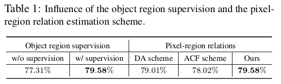
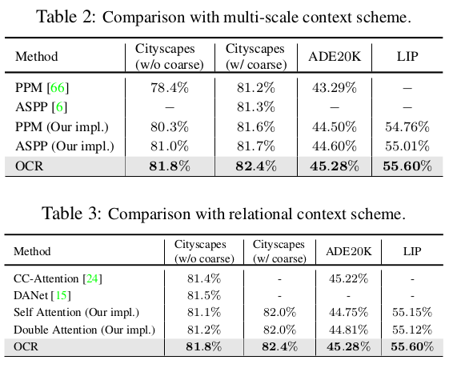
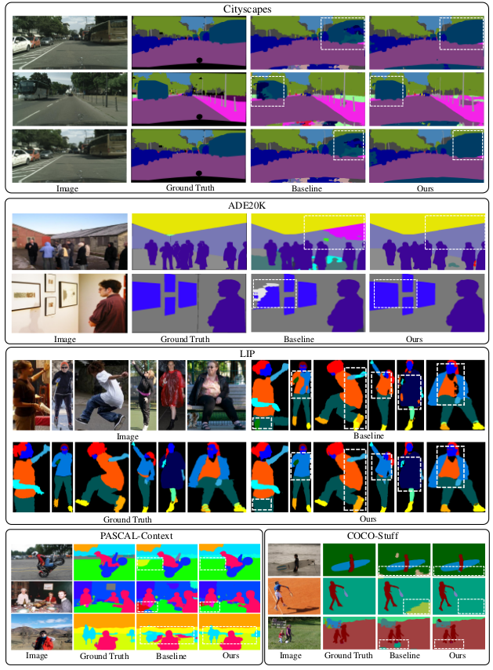

# \(2019\) Object-Contextual Representations for Semantic Segmentation

## Introduction

* 초기에는 ASPP, PPM과 같은 multi-scale context를 보는데 초점을 맞춤
* 최근에는 position과 contextual position 사이의 관계에 집중
* 제안된 논문에서는
  * position과 context사이의 관계를 이용하여 contextual representation을 추출하는 scheme제안
  * 같은 class의 pixel의 집합\(object region\) 추정
  * 같은 context pixel끼리의 representation을 augment하여 object region을 추정
  * 앞선 2개를 통합하여 OCR\(Object Contextual Representation\)을 추출하여 최종적인 output을 냄

## Methods

### Soft object regions

* Backbone에서 나온 convolutional feature에 대해 segmentation output을 생성

### Object region representations

$$
\mathbf{f}_k = \sum_{i \in \mathcal{I}} \tilde{m}_{ki} \mathbf{x}_i
$$

* Backbone feature \(pixels\)에 soft object regions의 값을 weighted sum한 것
* f\_k 는 k번째 object에 대한 representation으로써 Channel X Classes의 크기를 갖음\(Channel은 해당 class를 표현하는 vector\)

### Object contextual representations

$$
w_{ik} = \frac{ e^{ \mathcal{K} (\mathbf{x}_i,\mathbf{f}_k) }  }{ \sum_{j=1}^K e^{  \mathcal{K} (\mathbf{x}_i ,\mathbf{f}_j) } }
$$

* Pixel과 object region에 대한 가중치를 별도의 transform function를 거친 후 서로 dot product한 것
* 최종적인 Object region에 대한 contextual representation을 얻음
* i번째 pixel과 k번째 object간의 관계\(소속정도\)를 표현하기 때문에 contextual한 정보를 담

### Augmented representations

$$
\mathbf{y}_i = \rho( \sum_{k=1}^K w_{ik} \delta(\mathbf{f}_k) )
$$

$$
\mathbf{z}_i = g( [ {\mathbf{x}_i}^T {\mathbf{y}_i}^T  ]^T )
$$

* Pixel과 object간의 상관관계와 object의 representation을 weighted sum하여 object의 표현을 최종적으로 증강함\(self attention 정보\)
* Pixel과 self attention정보를 concat하여 최종 output을 산출

## Results & Conclusion

* Object region에 대해 loss를 계산하여 학습하면 성능이 오름\(아마 더 정확한 object region 영역을 미리 추정하기 때문인듯\)
* Pixel region relation을 계산하는 방법을 DA, ACF 방법과 비교하여 제안한 방법이 더 좋음을 확인
* Cityscapes, ADE20K, LIP, PASCAL-Context, COCO-Stuff 데이터셋에 대해 성능 검
* Contextual representation을 추출하는 방식을 새롭게 제안하여 성능을 높인 점이 흥미로움
* Encoder, Decoder 기반의 방식이 아니고 단순 bilinear upsampling에서 높은 성능을 보이는 것이 Pixel당 정확한 representation을 갖음을 확인시켜

## References

* [https://arxiv.org/abs/1909.11065](https://arxiv.org/abs/1909.11065)
* [https://github.com/rosinality/ocr-pytorch](https://github.com/rosinality/ocr-pytorch)

