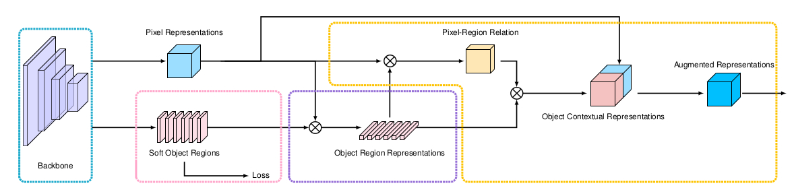

# \(2019\) Object-Contextual Representations for Semantic Segmentation

## Introduction

* 초기에는 ASPP, PPM과 같은 multi-scale context를 보는데 초점을 맞춤
* 최근에는 position과 contextual position 사이의 관계에 집중
* 제안된 논문에서는
  * position과 context사이의 관계를 이용하여 contextual representation을 추출하는 scheme제안
  * 같은 class의 pixel의 집합\(object region\) 추정
  * 같은 context pixel끼리의 representation을 augment하여 object region을 추정
  * 앞선 2개를 통합하여 OCR\(Object Contextual Representation\)을 추출하여 최종적인 output을 냄

## Methods

### Soft object regions

* Backbone에서 나온 convolutional feature에 대해 segmentation output을 생성

### Object region representations

$$
\mathbf{f}_k = \sum_{i \in \mathcal{I}} \tilde{m}_{ki} \mathbf{x}_i
$$

* Backbone feature \(pixels\)에 soft object regions의 값을 weighted sum한 것
* 같은 soft object region의 pixel들의 가중치로 볼 수 있음

### Object contextual representations

$$
w_{ik} = \frac{ e^{ \mathcal{K} (\mathbf{x}_i,\mathbf{f}_k) }  }{ \sum_{j=1}^K e^{  \mathcal{K} (\mathbf{x}_i ,\mathbf{f}_j) } }
$$

* Pixel과 object region에 대한 가중치를 별도의 transform function를 거친 후 서로 dot product한 것
* 최종적인 Object region에 대한 contextual representation을 얻음

### Augmented representations

$$
\mathbf{z}_i = g( [ {\mathbf{x}_i}^T {\mathbf{y}_i}^T  ]^T )
$$

* 얻어진 Object contextual representation과 pixel 사이의 관계를 다시 한 번 weighted sum하여 최종적인 output을 정의

## Results & Conclusion

## References

* [https://arxiv.org/abs/1909.11065](https://arxiv.org/abs/1909.11065)
* [https://github.com/rosinality/ocr-pytorch](https://github.com/rosinality/ocr-pytorch)

