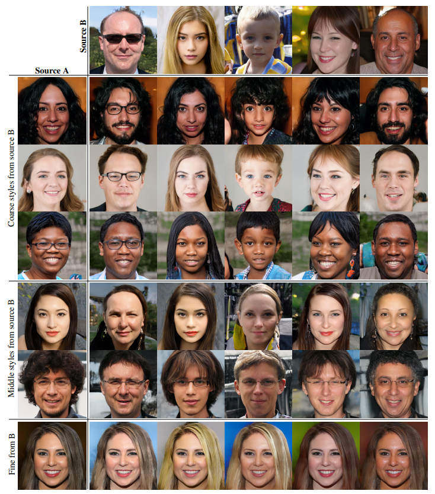
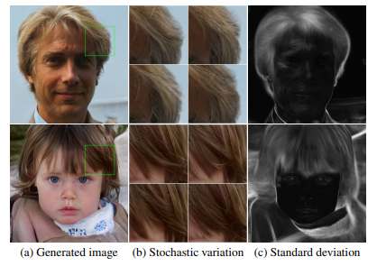
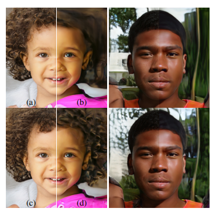
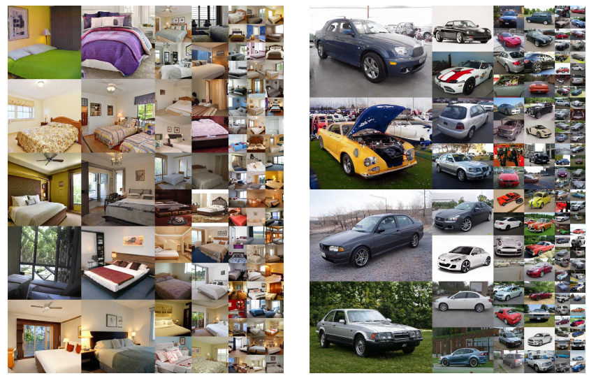

# \(2018\) StyleGAN

## 1. Introduction

기존 GAN에서는 random noise input \(latent space\)가 특정 분포 \(ex - uniform\)을 따르기 때문에 다양한 변화를 갖는 dataset에 대해 제대로 된 output을 내기 어려웠다. 제안된 논문에서는 아래와 같은 점들을 추가하여 Style을 적절하게 반영한 HD 이미지를 output으로 만들 수 있게 하였다.

* Immediate latent space : random noise vector를 또다른 분포로 변화시키는 network를 거쳐 단순한 하나의 분포가 아닌 다양한 분포를 통해 이미지 생성이 가능하게 만듦
* Input layer의 입력값 고정 : Vanilla GAN에서는 input을 random noise를 받았지만, immediate latent vector를 사용하는 style GAN에서는 input layer에 random한 값을 넣는 것이 의미 없어 constant vector를 사용함
* random noise : upsampling하는 각 layer에서 random noise를 더해주어 stochastic한 변화를 더해

## 2. Architecture & Properties

Style GAN의 모델 구조는 위와같다. \(a\)의 Vanilla GAN과 다르게 기존의 input으로 사용하던 random noise vector를 Immediate latent space로 변화시키는 FC로만 구성된 network의 input으로 사용한다. 이렇게하면 고정된 분포의 input을 다양한 모양의 분포 vector로 변화를 주어 output이 갖는 변화의 다양성이 커지게 된다. 추출된 Immediate latent vector는 다양한 변화를 갖기때문에 Synthesis network의 각 layer마다 style을 주는데 사용된다.

각 layer에 존재하느 Adaptive InstanceNorm module은 Immediate latent vector를 반영하고자하는 style의 형태로 변화를 준다. 또한, 각 layer에서는 random noise를 추가로 주어 Style의 세부적인 부분을 stochastic한 변화를 주게 한다.

Style GAN의 synthesis network는 input값이 고정으로 Constant tensor로 되어있는데, immediate latent vector로 style을 줄 때, input layer에서 random noise와 합쳐지는 것이 good quality의 output을 얻는 것에 큰 도움을 주지 않아 제거했다고 한다.

Up/Down sampling 과정에서 기존 GAN에서는 Pooling 방식을 이용하였는데 bilinear sampling을 도입하여 좀 더 깔끔한 output이 나오도록 변경하였다.

마지막으로 mixing regularization을 도입하여 layer간 style correlation을 줄이도록 하였다. mixing regularization은 immediate latent space를 생성하는 input인 latent code를 2개를 사용하여 처음부터 중간은 1번 latent code를 이용하여 학습하다 중간에 2번 code로 변경하여 학습하면 layer간 style이 correlated하지 않게 되어 다양한 style학습에 방해를 없애준다.

## 3. Experimental Results & Conclusion

### 3.1. Style Mixing

논문에서는 mixing regularization에서 소개된 2개의 random latent code로 학습된 source A, B를 어느 scale에서 합성하는지에 따라 다양한 style을 연출할 수 있다고 소개한다. 그림에서 살펴보면, Coarse한 style변화는 layer 4 ~ 8에서 합성한 이미지이다. 포즈나 얼굴형과 같은 큰 단위의 변화가 합성된다. 두 번째로 middle style의 변화는 16에서 32의 layer에서 합성되며, 얼굴 특징, 헤어스타일 등이 대표적이다. 마지막으로 fine style 변화는 그 외 layer에서 이루어지며, 머리색상과 같이 세부적인 사항이 주가 된다.

### 3.2. Stochastic Variation

Stochastic variation의 효과는 위 그림처럼 나타난다. \(a\)처럼 생성된 이미지에서 \(b\)처럼 같은 부분을 보았을 때, 머리카락의 생김새가 모두 다름을 알 수 있다. 실제로 \(c\)처럼 생성되는 이미지들의 변화를 지켜보면 fine한 부분이 noise에 의해 변화가 있는 것을 볼 수 있다. 이처럼 noise를 추가하는 것이 stochastic한 변화를 주는데 도움을 준다.

위 그림을 보면 \(a\)는 모든 layer에서 noise를 준 것이며, \(b\)는 모든 layer에 noise 추가가 없는 것이다. \(c\)는 fine style을 담당하는 layer에만, \(d\)는 coarse style을 담당하는 layer에만 준 것이다. 잘 살펴보면 noise를 주지 않았을 때보다 noise를 준 것이 훨씬 정교한 이미지를 생성하며, 더 다양한 이미지를 생성한다.

### 3.3. Result Images

LSUN dataset에 대해 학습하여 생성한 이미지들이다. 다양한 style이 적용되어 이미지가 만들어지는 것을 확인가능하다. 논문에서 따로 제안한 metric인 Path length와 Linear separability가 있는데 이는 생략한다.

## Reference

* [https://arxiv.org/abs/1812.04948](https://arxiv.org/abs/1812.04948)
* [https://github.com/taki0112/StyleGAN-Tensorflow](https://github.com/NVlabs/stylegan)
* [https://github.com/rosinality/style-based-gan-pytorch](https://github.com/rosinality/style-based-gan-pytorch)
* [https://heartbeat.fritz.ai/stylegans-use-machine-learning-to-generate-and-customize-realistic-images-c943388dc672](https://heartbeat.fritz.ai/stylegans-use-machine-learning-to-generate-and-customize-realistic-images-c943388dc672)

