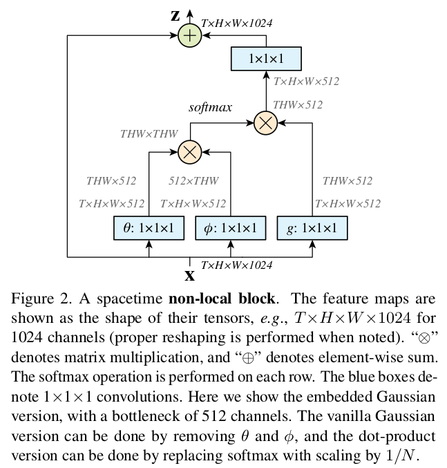
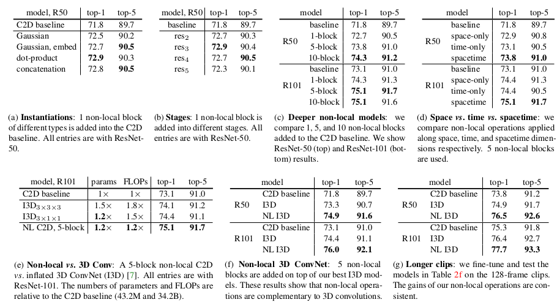
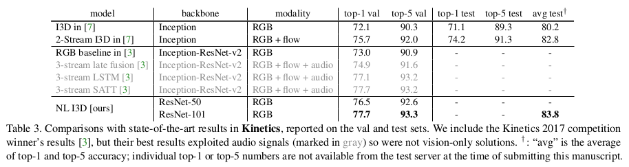

# \(2017\) Non-local Neural Networks

## 1. Introduction

* CNN, RNN에서 long-range dependency에서 local operation 사용
* image에서는 long-range dependency를 위해 receptive field를 넓게 잡도록 pooling등의 연산 필요
* local operation의 단점
  * long-range dependency 전파가 힘듦
  * 연산량이 많아지고, 최적화가 힘듦
* 제안한 방법의 이점
  * 어떤 두 지점 사이의 위치적 거리를 고려하지 않고 상호작용을 직접적으로 계산
  * 제안한 방법의 layer를 추가하면 적은 parameter 추가로도 큰 성능 상승을 보임
* Graphical model\(ex-CRF\)와는 다르게 복잡한 feedforward가 아님
* non-local means 방법이 self-attention과 유사함을 이용하여 더 확장시킨 버전으로 neural network에 적용
* Interaction network가 동작하는 것처럼 제안한 방법도 pair 단위의 연산이 이루어짐

## 2. Methods

$$
\mathbf{y}_i = \frac{1}{C(\mathbf{x})} \sum_{j} f(\mathbf{x}_i , \mathbf{x}_j)g(\mathbf{x}_j)
$$

* index i : i번째 output 위치\(space, time, spacetime 등\)
* index j : 모든 가능한 위치\(i포함\)
* x : input vector\(image, squence, feature 등\)
* y : input과 같은 크기의 output vector

제안된 Non-local block의 계산은 function f를 통해 x\_i와 x\_j 사이의 유사도를 계산한다. 계산된 유사도는 function g를 통해 얻어진 weight를 곱하여 weighted sum과 가중범위를 줄이기 위한 normalization을 거쳐 output vector를 계산한다. 이러한 계산은 Fully-connected layer와는 다르며, deep learning에 최근 많이 사용되는 attention 기법과 같다. 해당 수식을 통해 output i에 가장 영향을 많이주는\(유사한\) feature들을 골라 학습할 수 있게된다.

### 2.1. 수식 변화 실험

* function g는 학습 가능한 W\_g와 x\_j 간의 weighted sum이며, function f의 경우 무엇으로 측정하냐에 따라 결과가 달라진다.

2.1.1. Gaussian

$$
f(\mathbf{x}_i , \mathbf{x}_j)=e^{\mathbf{x}_i^T \mathbf{x}_j}
$$

* Non-local means와 bilateral filter에도 사용되는 gaussian 유사도 계산법.

2.1.2. Embedded Gaussian

$$
f(\mathbf{x}_i , \mathbf{x}_j)=e^{\theta(\mathbf{x}_i)^T \phi(\mathbf{x}_j)}
$$

* 위의 gaussian 형태에 dot product를 하는 feature vector를 embedding function을 거쳐 각기 다른 embedding vector로 만들어 진행.
* 이 방법은 softmax계산과 유사하게 볼 수 있어 다음과 같이 표현이 가능하다.

$$
\mathbf{y}=softmax(\mathbf{x}^TW_{\theta}^TW_{\phi}\mathbf{x})g(\mathbf{x})
$$

2.1.3. Dot product

$$
f(\mathbf{x}_i , \mathbf{x}_j)=\theta(\mathbf{x}_i)^T \phi(\mathbf{x}_j)
$$

* Embedded gaussian에서 softmax 부분을 제거하여 순수한 embedding vector의 dot product만 수행된다.

2.1.4. Concatenation

$$
f(\mathbf{x}_i , \mathbf{x}_j)=\mathbf{ReLU}( 
\mathbf{w}_f^T[ \theta(\mathbf{x}_i), \phi(\mathbf{x}_j)])
$$

* \[x1, x2\] 연산으로 2개의 embedding vector를 합쳐서 weight vector w로 계산한다.

### 2.2. Non-local Block

$$
\mathbf{z}_i=W_z \mathbf{y}_i + \mathbf{x}_i
$$

* 위 그림은 위 수식을 자세하게 표현한 것이다.
* 연산량을 줄이기 위한 트릭으로 input 채널을 1x1x1 convolutional layer를 거친 후,  max pooling으로 절반으로 줄인다. \(image와 같이 2d에서 max pooling을 하기 때문에 실질적으로 4배의 연산 절약 효과가 보임\)
* 마지막에 input vector x를 다시 더해 residual operation도 해줌

## 3. Results & Conclusion

* 8 GPU, GPU당 8 clip 할당
* 224 x 224 random cropping
* fine-tune 시, Batch normalization을 넣어 과적합을 줄임
* non-local block에서 마지막 W\_z이 후에만 BN을 넣

### 3.1. Ablation Study

**3.1.1. 기본 모델들** 

**2D ConvNet baseline**

* Resnet 50기반으로 Time\(depth\)쪽으로 32를 가져가는 baseline을 테스트
* convolution layer가 2d이기 때문에 time 방향으로는 pooling으로만 연산이 진행됨

**Inflated 3D ConvNet**

* 2D 모델에서 kernel을 inflating\(확장\) 시켜 시간축에 대해서도 연산 가능하게 변경
* pre-train된 2D 모델을 가져와 초기화를 진행하며, 시간축에 대해 k x k kernel을 시간축의 크기만큼으로 나누어 동일 값을 할당

**3.1.2. Results**

* \(a\)의 결과로 function f로는 dot-product가 가장 효과적인 것을 확인 가능
* \(b\)의 결과로 어느 stage 쯤에 non-local block을 넣어야 효과적인지 알 수 있음
* \(c\)의 결과로 몇 개의 layer를 넣어야 가장 좋은지 알 수 있음.\(모델마다 최적 수가 다름\)
* \(d\)의 결과로 non-local 연산을 어느 축에 적용해야 좋을지 알 수 있음.\(가장 좋은 것은 공간과 시간축 모두\)
* \(e\)의 결과로 non-local을 삽입하면 파라미터 수와 연산량에서도 이득을 보면서 결과도 좋음을 알 수 있음
* \(f\)의 결과로 3D에도 NL을 삽입하면 일단 좋음
* \(g\)의 결과로 입력값으로 더 긴 clip을 넣어도 NL을 통해 long-range dependency를 잘 가져감을 알 수 있

* 그 외 SOTA와도 비교했을 때, optical flow + audio정보를 더해야 NL을 삽입한 것과 유사한 결과를 보임
* non-local means의 방식을 참고하여 deep learning에 적용한 것이 흥미로움
* similarity 계산, layer의 위치, 수 등 다양하게 실험하여 제안된 방법이 좋음을 잘 입증한

## References

* [https://arxiv.org/abs/1711.07971](https://arxiv.org/abs/1711.07971)
* [https://blog.lunit.io/2018/01/19/non-local-neural-networks/](https://blog.lunit.io/2018/01/19/non-local-neural-networks/)
* [https://github.com/facebookresearch/video-nonlocal-net](https://github.com/facebookresearch/video-nonlocal-net)

