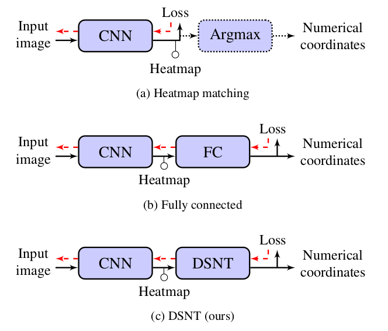
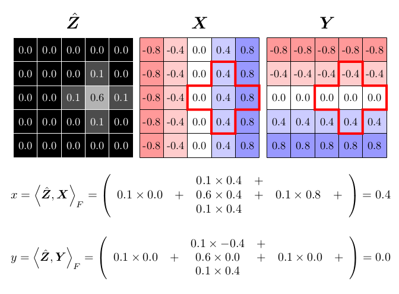
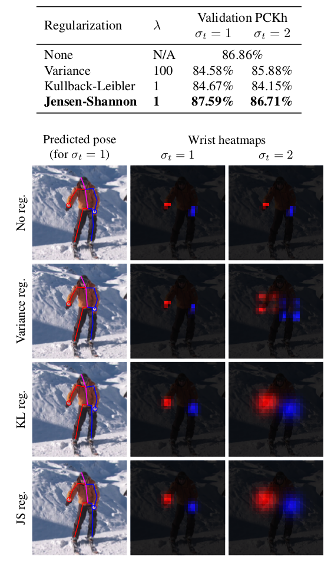
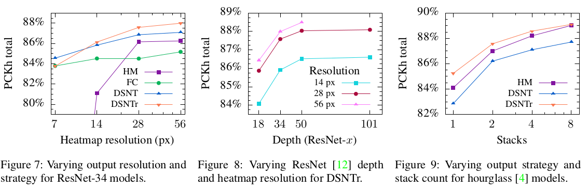

# \(2018\) Numerical Coordinate Regression with Convolutional Neural Networks

## Introduction

* CNN 학습에서 spatial 일반화가 잘된 모델은 Target이 어디있던 잘 찾음\(좌표 Regression\)
* 몇 가지 regression 방법들
  * heatmap 기반 : gradient 전파가 안되서 최적화 어려움
  * FC layer 기반 : overfitting이 일어나기 쉬움\(한 쪽으로 쏠려있는 좌표들만 갖고 학습하면 반대쪽 좌표를 찾기 어려움\)
* 제안하는 방법\(DSNT\)의 이점들
  * Low-resolution에서도 잘 동작
  * spatially generalization 잘됨
  * 별도의 파라미터 X
  * FC layer기반 처럼 직접 loss 계산 가능

## Methods

$$
X_{i,j} = \frac{2j-(n+1)}{n},\quad Y_{i,j} = \frac{2i-(m+1)}{m}
$$

* 각 좌표 X, Y에 대한 spatial weight는 위와 같은 수식으로 계산함.\(m,n은 height, width\)
* heatmap Z와 weight X, Y 간 곱을 parameter sigma에 대해 일정 범위 내에서 weighted sum하여 0~1사이의 범위로 좌표를 표현
* 최종 좌표 Z는 X, Y의 평균
* 이 때, heatmap은 top-left가 \(-1, -1\), bottom-right가 \(1,1\)로 일반적인 coordinate 좌표는 항상 2사분면에 몰려 있다고 볼 수 있음
* heatmap의 activation 함수는 가장 성능이 좋게나온 softmax 사

$$
\mathcal{L}_{euc}(\mu, p) = || p-\mu ||_2
$$

* Euclidean loss는 Z의 평균과 target p에 대해 계산됨. 이 때, heatmap의 가장 밝은 곳이 항상 정답은 아님\(이런 상황에서는 euc로 계산 시 오차가 커짐\)
* 이를 극복하기 위해 variation과 distribution에 대해 regularization term을 실험함.

## Results & Conclusion

* Regularization 실험 결과 JS reg가 가장 성능이 좋음.
* Lambda와 sigma\(gaussian size\)를 변경하며 테스트 -&gt; gaussian은 작고 lambda는 어느정도 큰 것이 성능이 좋

* 기존의 FC, heatmap 기반보다 DSNT가 좋음
* Low-resolution에서도 잘되지만, high-resolution일수록 성능이 좋아짐\(아주 큰 차이는 아님\)
* hourglass model에서 stack수가 많을수록 성능이 좋아
* 시간/memory 효율이 좋음

## References

* [https://arxiv.org/abs/1801.07372](https://arxiv.org/abs/1801.07372)
* [https://github.com/anibali/dsntnn](https://github.com/anibali/dsntnn)

