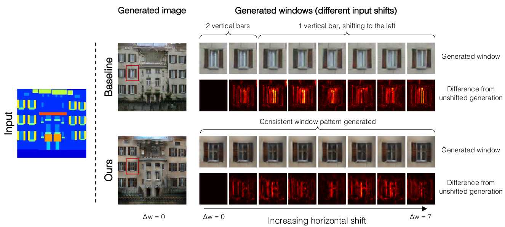

# \(2019\) Making Convolutional Networks Shift-Invariant Again

## 1. Introduction

* 전통적인 low-pass filtering은 down sampling 시 anti-alias 효과
  * 현재 딥러닝에서는 이 부분이 크게 도움되지 않음
* max/avg pooling 시 shift invariant 하지 않음
* 제안하는 방법
  * Max-pooling 시 low-pass filtering을 추가함
  * 기존 down-sampling과 비교하여 성능 향상
  * shift되는 변화에 강건함

## 2. Methods

* 기존의 pooling은 위의 baseline과 같음. 하지만 제안한 방법은 그 과정에 blur filter를 넣어 anti-aliasing 효과를 추가함
* 이는 shift된 input과 그렇지 않은 input이 동일하다는 가정하에 진행
* max 값을 그대로 sub-sampling 하는 것보다 blurring 후 하는 것이 edge등과 같은 급격한 변화를 보이는 곳에서 aliasing을 줄여 shift-invariant해짐
* 이를 다양한 layer에 적용하여 성능을 올림\(Max/Avg Pooling, convolution\)

* Anti-aliasing filter 선정 시 다음과 같은 다양한 모델을 사용
  * Rectangle-2
  * Triangle-3
  * Binomial-5

## 3. Results & Conclusion

* CIFAR, ImageNet, GAN 데이터에 적용하여 test성능 확인
* 각 layer에서 편차율을 확인할 때, baseline보다 변화량이 적어진 것을 확인

* Baseline과 anti-aliasing을 적용한 것들의 classification 성능 비교
* Rect-&gt;Tri-&gt;Binomial로 갈수록 성능이 좋

* label을 이용해 image를 생성해내는 task에서도 shift-invariant를 보여줌
* baseline\(pix2pix\)과 비교하여 원본과의 shift됨을 볼 때, 차이가 두드러지게 작음을 확인 가
* 하지만 생성하는 task에서는 binomial로 갈수록 너무 과한 smoothing으로 생성된 이미지의 quality가 떨어질 수 있

## Reference

* [https://arxiv.org/abs/1904.11486](https://arxiv.org/abs/1904.11486)

